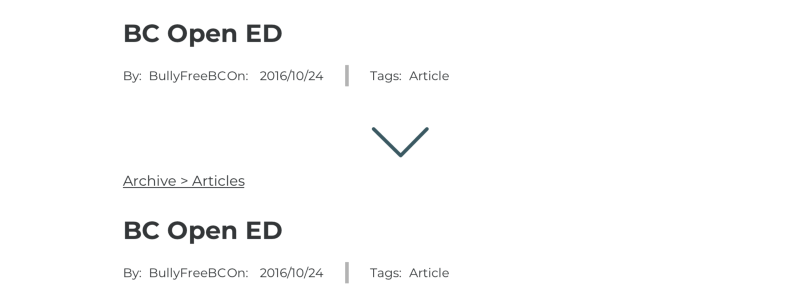

<section>

> When you see the words “bully-free website”, what do you think of and what do you expect to take away from such a place?

In the past, our client had an organization dedicated to creating changes in anti-bully policy in workplaces and government.

Now they needed to rebuild the organization by gaining the trust of new members, without leaving bullying victims out of the picture.

We were tasked with designing a responsive web prototype that can be the start for our client to begin her social movement once again.

<!-- During the course of this project I learned about:

* designing contrary to existing expectations of users
* meeting business goals within constraints discovered from our client
* testing, then testing again -->

</section>

<section style="background-color:#D2DCE1">

### Understanding the challenge

BullyFreeBC(BFBC) is a non-partisan, non-affiliated organization that is undergoing a relaunch of their website and rebuilding their network of professionals who want to enact social change.

The top level goals of our client were:

* Offer bully-free advocates templates and information to help them start anti-bullying projects on their own.
* Connect like-minded advocates with a network of similar individuals.
* Do not offer help services. BFBC cannot advise or counsel anyone legally.

### My Role

I worked with two other UX designers to:

* Audit the existing website.
* Test and measure the expectations of incoming users.
* Plan the features the website will offer.
* Test and measure the expectations of incoming users again.
* Design a responsive web prototype in paper then in Sketch.

I led the production of wireframes and design assets by creating and managing shared Sketch Libraries for the team.

With the cooperation of the team, I implemented a production process that allowed for the UX team and UI team to work in parallel instead of in a monolithic fashion.

</section>

<section>

### Finding our walls

From our first client kickoff we learned:

* BFBC wants to be an intermediary, which means presenting as stand-offish.
* Past victims of bullying may visit the website which meant the website must feel safe.
* A focus on creating documentation to help make actionable change in workplaces.

These guidelines were crucial to the feel of the design as the audience involved people at risk which need to be treated with care.

### Early exploration

When you see the words:

> Bully-free website

What do you expect?

We didn't really know what our users expected from our client or anti-bullying websites. So we used the question above as a research hypothesis to help us look at:

* Who are the main users of the site?
* What is a bully-free website?
* How do they expect to navigate a bully-free website?
* How do they currently navigate the existing website?
* What encourages or discourages joining an anti-bullying community?

We sent out a survey to potential users, conducted interviews with past members of BFBC, and tested the existing website with potential users to gain insights.

<!--  -->

### What we found

<!--  -->

From interviews and testing the existing website, we learned:

* People can’t join what they don’t know.
* Of the many reasons previous members joined BFBC, the top was to make an impact.
* Credibility and historical precedent were the most cited reasons for individuals to join.
* The existing website is cluttered and disorganized. It feels unwelcoming and no trust is built.

</section>

<section>

### What do you expect?

A common theme that came up during exploration was:

> "I expect to get help when I visit a bully-free website."

If an experienced user who uses BFBC's website is already unsure of what they are looking at, then the experience for a new users must feel like they are lost at sea.

Other organizations in the anti-bullying domain generally offer services like:

* One on one counselling.
* Help hotlines.
* Support networks for bullying victims.

Which run contrary to what BFBC's goals are. This revealed to us that we were designing for an experience contrary to the expected.

</section>

<section>

## Managing User Expectations

> So how do we bridge the gap in expectation of our users? How do we embed the idea that BFBC is an intermediary to a network of similar advocates?

Before we could start to design the website, we needed to know what our users expeceted and have BFBC's expectations and our user's expectations meet in the middle.

We still didn’t fully know who our user was.

So we made a user. Meet Michelle:

In Michelle’s life she’s had friends close to her bullied and co-workers in the workplace bullied. From this she is motivated to make changes so that doesn’t happen again.

Addtionally we have to keep in mind bullying victims may visit the website, but we did not make a full persona for that type of user.

#### Framing the problem

We used Michelle to guide the feature requirements of the website and to remind us of the expectations that our users have. Michelle needs to have her pain points address which we choose to do through:

</section>

<section>

#### Making an MVP

The features we chose to implement became our Minimum Viable Product, our MVP. This MVP needed to satisfy early adopters of BullyFreeBC and not dive deep on all of the possible features BFBC could have. The features that we did not cover here will be kept in mind for future launches of the BFBC website.

We decide in order of important to implement:

* Quick Exit
* Disclaimer messages
* Testimonials, accomplishments, and additional trust building collateral
* Call to Action (CTA) buttons across all top level pages.

> For users who may be victims of bullying or stuck in an abusive situation, quick exit can save a life.

Disclaimer messaging needs to alert users to the fact that BFBC isn’t a service provider. This message funnels users who may be victims of bullying towards the help directory instead of somewhere they don’t need to be.

Features such as achievements page, current events at BFBC, and a resource library are for our potential users. Showing off the accomplishments of BFBC in the wild and showing growth to potential members builds the credibility of BFBC as something they can contribute in and grow as bully free advocates. Membership calls to action (CTAs) on each page drives membership acquisition.

</section>

<section>

#### Sidenote on content

Being different to a traditional anti-bullying website meant that we wanted to:

* Communicate BFBC’s message of advocacy primarily and to offer help secondarily.
* The tone of voice should be stoic and not be overly supportive.
* BFBC to be experienced as an intermediary instead of a help service.

</section>

<section>

#### Moving from feature sets to user flows

I envisioned two main flows that BFBC would accomadate.

* A journey towards joining BFBC, showing reasons why along the way.
* Directing those in need of help immediately to where they need to be.

The fork in the road for these two flows starts at the moment a user arrives, which meant I needed to have this fork appear on the homepage.

The first journey was designed to tell the story of BFBC and to give opportunities to join BFBC.

The second journey takes the user to external support services. On that page itself, there are in-page hotlinks to hotlines & resources which take users out to external websites from there.

If this user finds themselves in a potentially dangerous situation they can use the quick exit button to find cute dogs and cats.

</section>

<section>

## Design

### Introducing BullyFreeBC

Let me side track you for a moment and present you the final high fidelity prototype.

<!--  -->

### Hi-fi prototype and Mid-fi Walkthrough

You can find our high fidelity prototypes online:

[Web Prototype](https://invis.io/XUTP2D373MS)

[Mobile Prototype](https://invis.io/CBTP2HBDWXK)

For now, you are:

These prototypes were presented to the client from the prespective of Michelle, walking through her experience on the web prototype.

For our potentially in distress users we did a short walkthrough on the mobile prototype.

</section>

<section>

## How we got there

#### Low fidelity iterations

In iterating during paper prototyping we found:

* Micro content such as labels have a large impact on new users ability to navigate effectively on their first try.
* Lost users needed help to get back on track.
* Don't make them think, put what users should see in front of users.

Our initial prototypes grasped at the core functionality of what we envisioned, using boxes and simple labels to direct testers to where they would be going next.

Early testing with paper prototypes helped us re-word our headings. If you remember the question from earlier again,

> We wanted to constantly test what our user’s expectations were and see of our designs matched those expectations.

Labels changed from friendly labels into stoic labels to ensure our navigation had clear purpose. Feedback from our testers gave us the impression that our initial run of labels gave misleading expectations, for example "Our Resources" gave the impression that we (BFBC) offered resources or services.

We also added Breadcrumbs within the archive so users can return to their last level of research topic, as two of our testers mentioned aloud that they were unsure of how to get back to what they were researching.

On the help page, users originally had to scroll a little to see the bulk of support links — this ended up defeating the entire purpose of page. We changed it up to include two buttons at the top that scroll a user to the required section further down on the screen.

We took these testing notes and changes into the digital world, by making wireframes in [Sketch](https://www.sketch.com/).

</section>

<section>

#### Mid fidelity prototypes iterations

After we built out our wireframes in Sketch, we made changes based on testing for:

* The logical positioning of the quick exit button, and it's effects on conventional navigation placement.
* Page content and messaging, making sure we were getting across to the user.

Because quick exit has to be easily accessible, we looked at general conventions for where to put the button on screen. Conventionally on Windows computers, close window is on the right so we wanted to place it on the right as well.

> The problem is, search is also conventionally on the right.

If we put them together people in a hurry to quickly exit may accidentally click the search button, so quick exit should be isolated from other buttons to avoid accidents.

We ultimately put search on the left, user testing told us that users themselves liked seeing quick exit prioritized and while it’s different to see search on the left users weren’t too unhappy with it and could still find it.

The ideal plan was to direct people who need help as soon as possible to the support page, but we found through testing users weren’t reading the disclaimer. What was wrong?

> What incoming users saw was “do you need support”.

I flattened the hierarchy between the elements to promote reading all of the content, we did not get to test this change for the final prototype.

</section>

<section>

#### Side note on our process from mid fidelity to high fidelity

To make the process easier for both UX and UI to work in tandem, I implemented the usage of a neat Sketch plugin called [Camilo](https://medium.com/makingtuenti/camilo-our-tool-and-technique-for-one-click-brand-change-in-sketch-52-2060ae4161ae). This plugin let us work on the wireframes and the high fidelity user interface at the same time, instead of needing pass our work back and forth.

By making two wireframe files and different shared library files, the team could make our mid fidelity wireframes using a shared UX library and have the UI team work on those wireframes as they came in on their own version of a shared UI library. Then when we finished a wireframe it could be transitioned into high fidelity with a click of a button and visual elements repositioned as needed.

From here we passed our wireframes onto our UI team who made the project come together with the branding, style, and tone of voice for BFBC. You can see how they came up with the branding and tone of voice here: [Andrew Macdonald's BFBC Case Study.](https://medium.com/@andrew.nwmacd/cc0883e58e86)

</section>

<section>

### Future UX considerations

For future launches, we envision building out the members only features of the website like a members forum and to expand on the current ongoing events at BullyFreeBC to further build credibility to potential members.

### Thoughts and final remarks

At the beginning of the project, my understanding of the client needs felt like I was restricted and that I had no foundation to build on top of.

As I worked with the team and with the client, we came to understand:

* the why behind the requests our client put in.
* how to build an experience that works within constraints.
* to sincerely empathize with the end users using tools like contextual inquires and user journey maps.

This project had the team and myself learn to factor in all the variables when designing for users, in this case looking at victims of bullying and those who want to support anti-bullying causes.

While this case study doesn’t focus heavily on victims of bullying, the considerations and constraints of designing for those users impacted the tone of voice and labelling for the rest of the project.

</section>