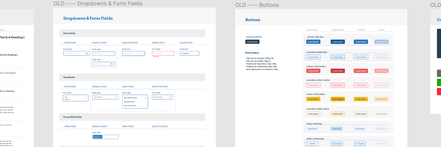
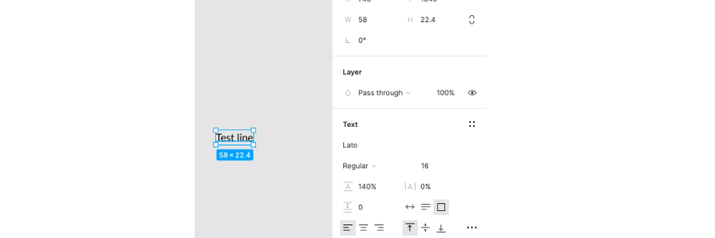
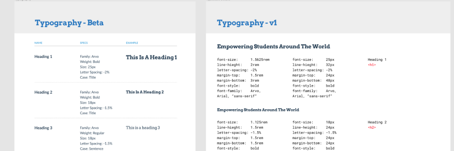
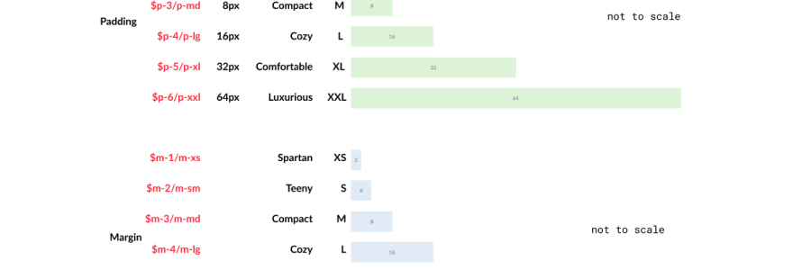
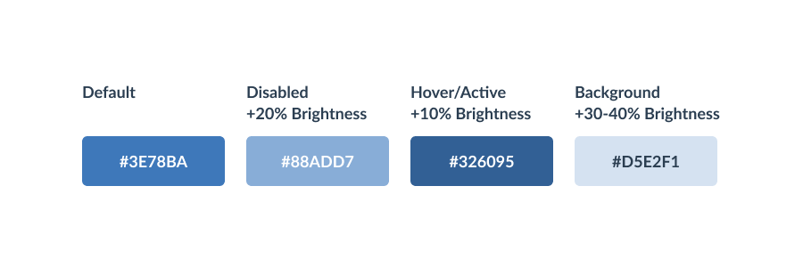
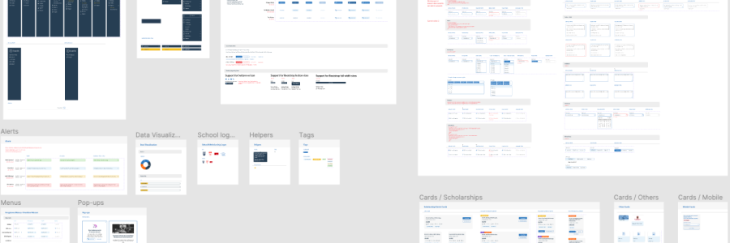
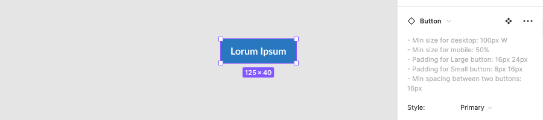
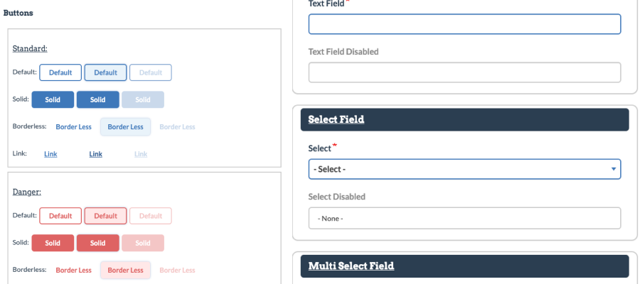

<section>

At GrantMe I went in being a gung-ho youngin looking to create the most sophisticated set of components and variants. I came out with a fairly lean component library and an appreciation for the people who put up with my pie in the sky dreams.

> What I ended with was more component library than design system.

Coming onto the GrantMe team, I was directed to update the existing Design System in Figma. There were outdated components not built with Figma's Auto Layout (god bless), and no record of what existed in app or only on Figma, and many components and atoms not respecting the grid structure.

I worked on the Design System over 3 months using 10% plus unallocated time in design sprints to complete work. At my time of leaving:

- GrantMe's design system setup in Figma with accessible colour and text styles.
- Auto Laid-out (I made this 🙂 ) Figma components for components used three or more times in-app.
- Partially developed into code. Type, colour, and spacing tokens created and maintained by development.

</section>

<section>

## Who, What, When, Where, Why

- Who: Ly Vu, Adam Grifiths, Arvind, myself.
- What: I learned that a design system in this context was a tool to help the design team keep work consistent for dev. Like most design work, *the context surrounding the work to be made defined the solution.*
- When: Dec 2020-April 2021
- Where: GrantMe design team of two.
- Why: Necessary with the design team expanding. Out dated work slowed down speed of delivery by design team.

</section>

<section>

## Story so far

I joined into an existing design system made by Ly. She had a set of components that were not up to date using Auto Layout as well as a set of text and colour styles that did not line up to an 8pt grid.

I was tasked with updating the components in Figma to align to the 8pt grid, update components to use Auto Layout when possible, and create a pattern for the team to use when designing new components or icons.

From that directive I made a rough order of operations to be completed.

- My Atoms - Text Styles, Colours, Spacing Tokens
- My Components
  - Button component - the humble but not so humble button
  - Form components - everything used by our team to make the various forms in app
  - Cards and other components - Dashboard cards, image cards used in grid displays, and alerts
- Tokenizing and getting the design system into code

And what the team ended up with:

- 8pt grid adherence at the atomic level (text and colour styles).
- Auto Laid-out components with appropriate Variants.
- A too large button component - what happens when you over build and over complicate
- Knowledge of the limitations of components - interactive components beta came out!
- Code tokens in place for type, colour, space, and some of the components.

</section>

<section>

## Accessible Colours and Text Styles

The goal for aligning our atoms to a 8pt grid was to ensure spacing in designs were consistent without thought by the design team.

I spent time looking up [typescales](https://type-scale.com/) in order to make a ["perfect third" typescale](https://spencermortensen.com/articles/typographic-scale/) that would replace the existing work. However after presenting my draft to the team, we determined the amount of work involved in redesigning all of our page layouts to fit a typescale based on perfect ratios would take away time from more pressing work.

We settled on adjusting the existing typescale to have line-heights fall on multiples of 8, which would result in aligning them to the 8pt grid.

A common problem with existing work was needing to space items manually and decide the spacing for each element on page. We decided on using a set pattern of spacing sizes from 4px to 32px for inside of components and up to 64 between components. Shamelessly taken from [eightshapes](https://medium.com/eightshapes-llc/space-in-design-systems-188bcbae0d62), this model made sense and could be applied by us on the design team in a logical manner quickly.

The existing colour styles were fine and I was directed to not change them at this time. What needed to do was set a defined method for making hover, active, and disabled versions of our existing colour styles.

I turned to [colour ramps](https://uxplanet.org/designing-systematic-colors-b5d2605b15c?gi=9a604c676eb4) to approach this problem at first, and realized that colour ramps wouldn't work for this problem as they would fundamentally require changing the base colours in some way. This is the ideal solution that was not possible within time.

The time efficient solution I arrived at came from was inspired by [Sujan Sundareswaran's take](https://sujansundareswaran.com/blog/why-hsl-is-better-than-hex-and-rgb) on the HSL colour model. I adjusted our colours by a set amount of it's Lightness. It works, it has a logical repeatable pattern for new colours, not the most elegant.

</section>

<section>

## Making with Auto Layout - Getting past blockers

Auto Layout's update back in 2020 is great for making components that resized and laid out well within other Auto Laid-out frames. I was able to remake many components that resized in multiple directions for different screen sizes, as the GrantMe platform is a web based app. **What Auto Layout is not great at is making components that behave perfectly and exactly as planned.**

There are limitations of Auto Layout, chiefly for our case was around minimum sizes. Workarounds for this include having variants that cover minimum size or instructing designers to drag out the component to a fixed width when under the minimum width. But there is no automated solution at the time of writing this.

I initially struggled with wanting to make all my components behave perfectly under all circumstances, however that resulted in having too many variants to cover every use case or having components that could not be made with Auto Layout.

At first I pushed for more time to work on the design system in order to make it "just right for us". On a car ride home I fired up my podcast roulette and heard this gem from the [Design Details podcast](https://designdetails.fm/episodes/hgPwR4Ey). In that episode Brian and Marshall talk about design debt which was the solutions I wanted more time to work on.

> "you don't have to solve all design debt in one go... be incrementally correct. The spirit of this is you don't have to solve all design debt at this moment."

Their suggestion led me to discuss with the other designer on the team, Ly, to decide on what we were okay with taking on as debt we would need to address as built which became the guiding process for moving past the "perfectionist" blocker.

These three measurements laid out what a task is taking and what trade offs we are balancing to do it. In an ideal world these levers should be at the same level, it's okay to have them be imbalanced based on the team's judgement. In our case we leaned towards pulling the time used and goal levers down with the debt incurred matrix going up.

> **Auto Layout is a great blessing for the productionist and a curse for the perfectionist.**

</section>

<section>

## Tokens and Components in Code

I took 4 weeks on and off to complete work on the design system. Once a week I would present to the lead developer, Adam, to get his feedback on the approach to systematic components and tokens that could be achieved by dev.

Arvind was assigned to help *me* on this project, as he had a personal interest in cleaning up outdated and messy CSS that existed. **We had a few dreams of using bigger tools like [Emulsify](https://docs.emulsify.info/), but instead opted to go lighter weight to stay within time constraints**. As a dev and design team we were limited to a month to get what we had of the design system into code, so we looked at steps achievable *in that time frame to move the needle.*

Arvind matched what I created in Figma, with a few meetings to go over naming conventions and technical limitations that were hammered out.

What we ended on creating for the team at GrantMe is a live set of webpages where the coded components are on display and can be referenced by other developers to see what code they should copy to replicate the same styling.

It provides a stable resource for the mainly contract based development team to stay consistent between developers and speed up onboarding new ones to producing quality, design matching, code.

</section>

<section>

## Learning Lessons from working on Design System

Too many to count here's some key takeaways from working on the design system:

- Do an audit of existing work as early as possible. Take a moment to survey the landscape before diving in.
- The design system is a product for internal users. It stands to reason that it should be treated like an external facing product. Give time for the appropriate research, testing, and documentation.
- Documentation is king, queen, country, whatever you want to call it. A design system is nothing without documentation. (Spoiler this is why I'm reluctant to call this a design system).
- Find an advocate for the design system on the development team. This smooths out work as you will always have a fighter who will both want this project to succeed.
- A design system will vary between people and companies. The rules, the artifacts, and tooling will all be decided by the people who create and use it. **That's okay...**
- What the design system should do is foster collaboration by being a mediator. In my short experience with attempting to make a design system, I found the design system most valuable being a mutually agreed upon look, feel, pattern, and language.

## Differences between a Design System and a Component Library

> No doubt tools like Sketch are super valuable, and having a set of reusable components inside them helps design teams establish thoughtful and consistent UIs. However, a Sketch library is just one piece of the design system puzzle...

Shamelessly taken from [Brad Frost](https://bradfrost.com/blog/post/your-sketch-library-is-not-a-design-system-redux/). He then goes on to list the other pieces of a design system like design and dev guidelines, tools, tone and brand guidelines, resources, and more.

What I believe we made were the starting blocks to a design system but not an actual design system. There is no guidelines setup, no rules or patterns to follow for contribution or maintenance, or explanation of tooling.

There is a component library in Figma and a set of coded tokens that devs use to style buttons, form elements, and assign colours. Not more than that however.

As a team we did some of Brad's step in making a design system, namely:

1. Make a thing.
2. Show that it’s useful.
3. Make it official.

</section>