<section>

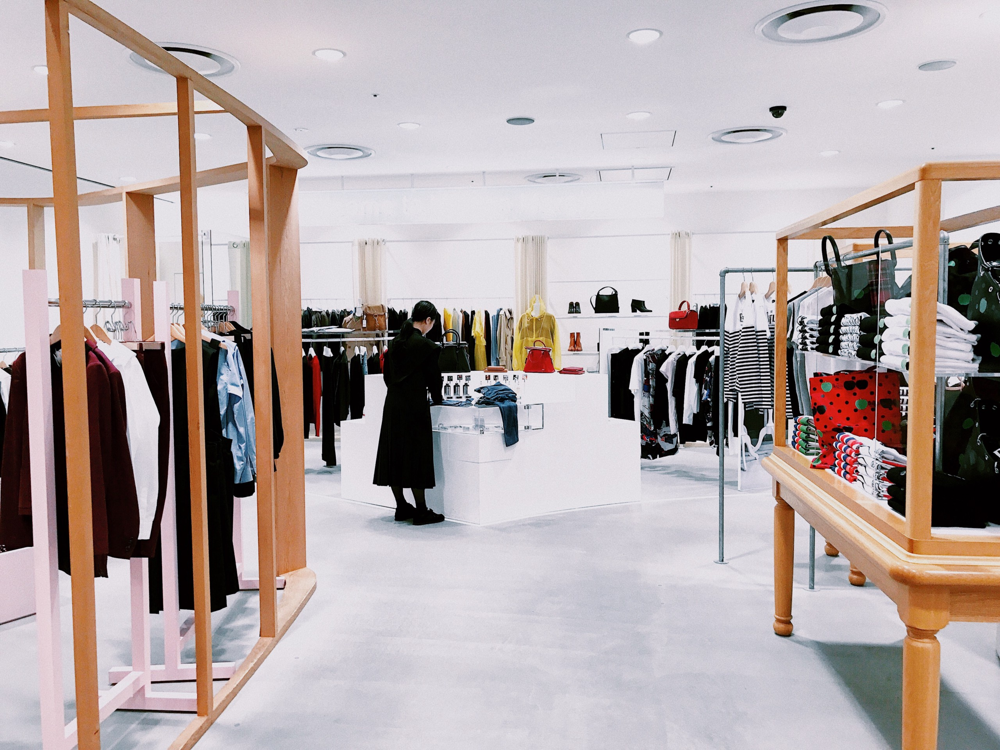

<figcaption>

Photo by [Cull & Nguyen](https://unsplash.com/@cullandnguyen?utm_source=unsplash&utm_medium=referral&utm_content=creditCopyText) on [Unsplash](https://unsplash.com/search/photos/boutique?utm_source=unsplash&utm_medium=referral&utm_content=creditCopyText)

</figcaption>

### Introducing Shop This City

In a team of five, three UX students and two UI students, we worked together over three weeks to design, prototype, test, and iterate on a community partner project.

Three weeks ago, we were introduced to Shop This City which is an app that bridges the gap between customers and local buyers through the common passion for fashion.

**In contrast with the previous student projects I’ve done at RED Academy, this project became about improving and designing an existing product instead of conceptualizing a completely new design.**


### Understanding the challenge

> Remember your last experience ordering clothes online, the anxiety of it not fitting and the anxiousness of waiting for it to arrive only to have to return it.

Shopping for clothes online can be frustrating, and browsing for clothes in person is time consuming. Shopping for clothes online entails research, comparisons, and waiting for clothes to arrive only for them to maybe not fit.

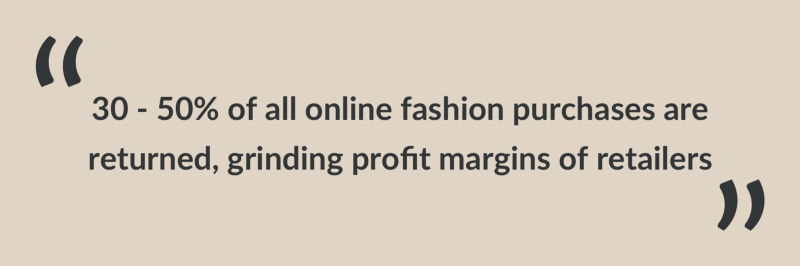

The growth of fashion e-commerce presents challenges for retailers and for consumers, for example the [high rate of returns](https://cdn.shopify.com/s/files/1/0898/4708/files/Fashion_Apparel_Industry_Report_Oct2018.pdf?5090634583332979364) eat at profit margins. Consumers value the experience of **being able to try items on** and having a **human connection**. Evidence of this comes from [Forbes](https://www.forbes.com/sites/gregpetro/2019/03/29/consumers-are-spending-more-per-visit-in-store-than-online-what-does-this-man-for-retailers/#4d6cb07a7543) and from the [BusinessWire](https://www.businesswire.com/news/home/20190304005625/en/71-Percent-Shoppers-Spending-In-Store-Online-New),

Our client, having been a professional stylist, has an intimate experience with the pain points of retailers and consumers first hand. From that realization that there is a gap between browsing for fashion digitally and finding those items physically, the idea for Shop This City (STC) was born.

At the time of bring the project to RED Academy, our client had made a simple database for inventories of stores that syncs with POS systems using a simple API and an app that shows that database. A core feature or lack of feature is the inability to purchase items through the STC app, **STC aims only to direct user traffic into local boutiques** instead of being an e-commerce app.

```grid|3


```

At the kick off meeting we got the business goals of STC, and start to lay those out against the project goals and user goals. We needed to create a mobile app that bridges that gap identified by our client, that addresses the difference between browsing for fashion digitally and shopping physically.

### Research Hypothesis

To start our research process off we started with a research hypothesis. We used this to focus our investigation based on initial domain research and client given data.

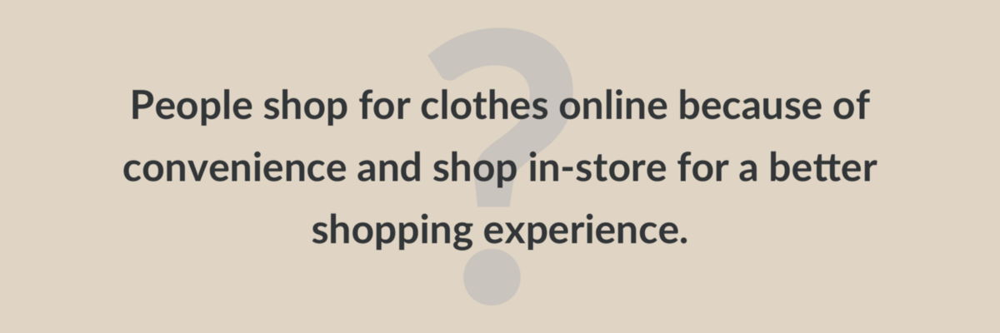

We looked at:

*   Who are our users?
*   What motivates and demotivates people to shop online?
*   What do people like and dislike about the in-store experience?
*   What features do people find most valuable about the online shopping experience and digital tools they use for it?

To find this information we conducted user interviews, store owner interviews, deployed a survey, and made a competitive/comparative analysis chart.

### What we found

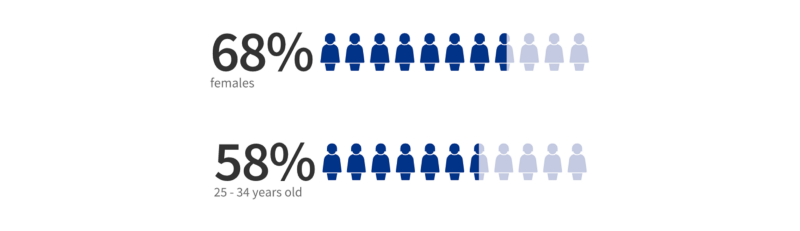

Our survey respondents were mostly female, ranging between 25 and 56 years of age, spending over $5000 a year on fashion purchases, and live in the Greater Vancouver area.

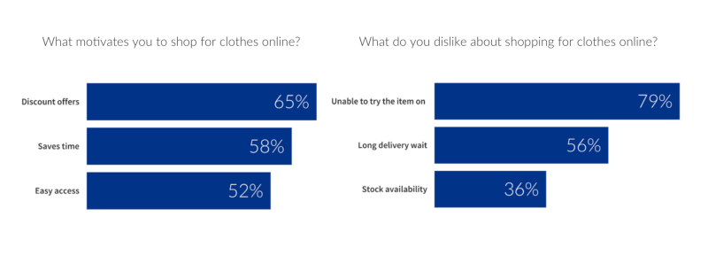

We asked our users about how they shop online and the habitual tendencies that they have. We gathered that the majority of our respondents are motivated by discount offers, low barrier to a checkout, and accessibility which is being able to shop from anywhere at anytime.

To follow up on our survey respondents’ habits we also asked what they did not like about shopping online. Most of our respondents replied that the inability to try items before buying, long delivery times, and stock unavailability were the issues they had with shopping online.

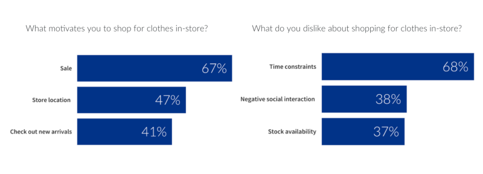

We next asked about their habits and experience of shopping in-store. Our respondents appreciated being able to shop in store when the location is convenient for them, if there is an ongoing sale, and being able to check out new arrivals in person. When asked about what they didn’t like about shopping in stores our respondents replied with lengthy time commitment, negative social interactions and lack of stock availability.

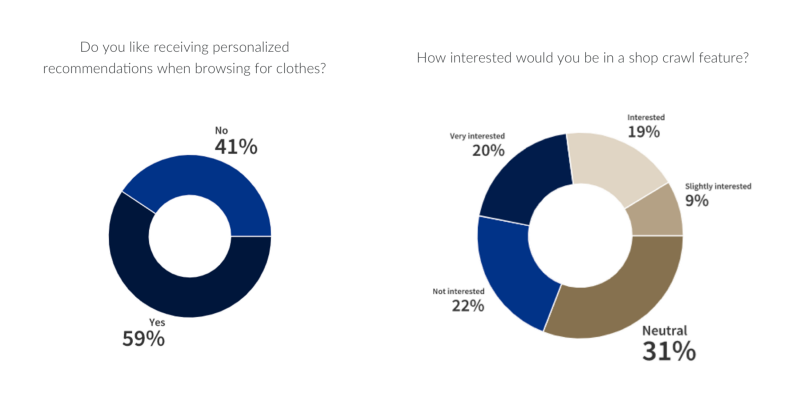

The last section of our survey was learning what features are valuable to our potential users, which covered personalized recommendations and a shop crawl feature. While our respondents responded favourably to personalized recommendations they also made the caveat that the surfacing of recommendations need to be done in an accurate and non-distracting manner.

We came up with an idea of a Shop Crawl feature, which would be similar to the brewery tours or pub crawls, where a user would be able travel through a map of stores. We felt this feature could have potentially built up the local shopping community and familiarize people to the local shopping scene. We learned that majority of our respondents didn’t see much value in this feature.

#### Interview insights

We interviewed three potential users and 2 store owners to get direct insights on shopper behaviour and on shopping locally.

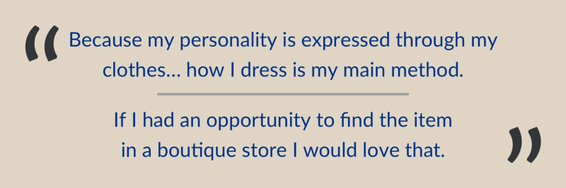

We learned that our interviewees would like to know what local boutiques had in stock but due to time constraints and travel times, they don’t have the opportunity to regularly browse those stores. They usually resorted to big brand stores like Nordstrom or Reitmans and were often disappointed with the lack of stock in particular items. If they shopped online, they’ve experienced anxiety of not knowing if size would fit and hated the experience having to ship back returns.

#### Research findings analysis

After conducting our research we summarized our findings with an affinity diagram. We used the diagram to form our potential features we want to consider for the STC app, and use that to take our next steps in the design process.

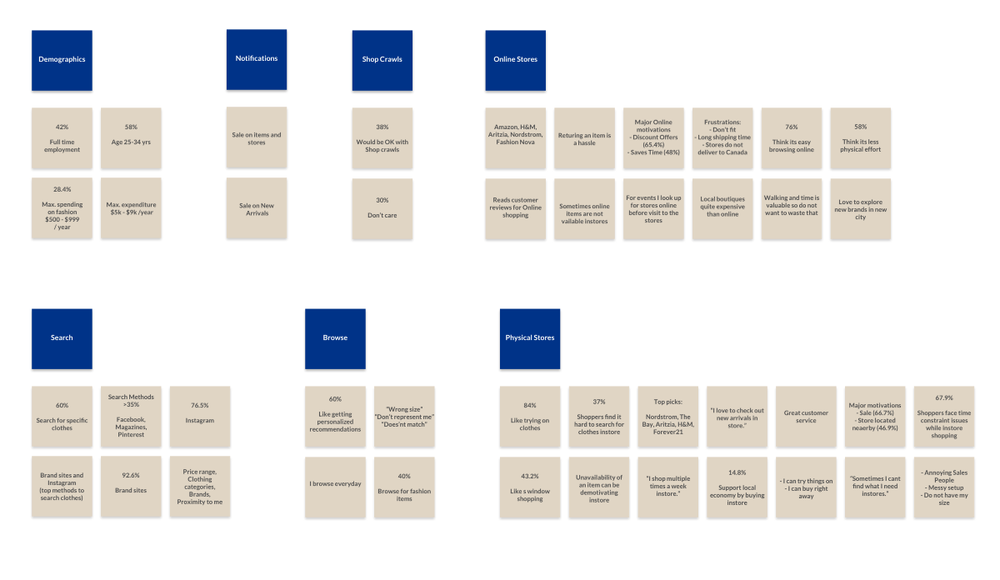

#### Feature Chart

We also made a feature chart by performing a competitive and comparative analysis. This helped us find the features that would add value to the STC app and give STC a unique selling proposition.

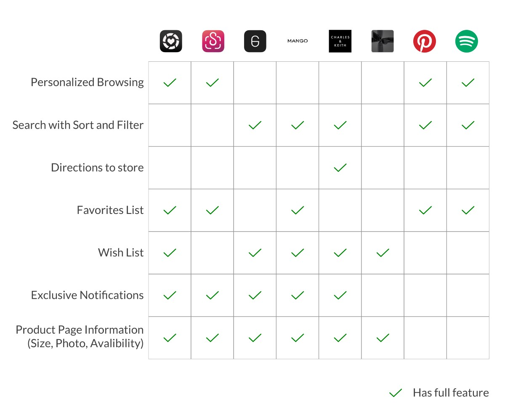

In making this chart we realized that STC could stand out by having all the features that the competitors and comparators lacked.

#### Feature Sort and prioritization

At this point we could sort our chosen features by using the bucket method to begin outlining our Minimum Viable Product. We sorted the features that are core to user functionality to the Must have bucket, features for a delightful experience into the Nice to have bucket, and non functional and infeasible features into Don’t need bucket.

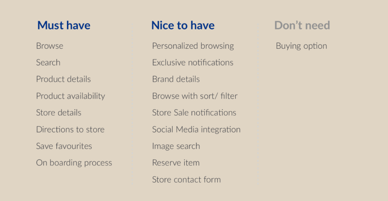

After sorting our features we measured their impact versus implementation effort to finalize our Minimum Viable Product of three weeks of work. We concluded that some of our proposed Nice to have features would have a lower impact versus implementation and have been left as suggestions for feature considerations.

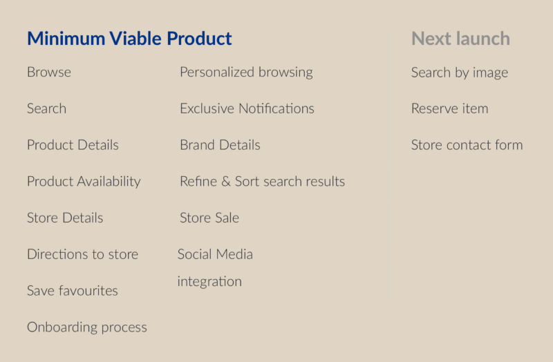


### Users and Goals

At this point we as a design team realized that there are two primary goals that STC aims to solve.

*   Searching for particular items, styles, and brands;
*   Browsing and curating a personal fashion catalogue through favouriting items, stores, and brands to receive personalized recommendations as well as notifications.

From our interviews we gained an insight that fashion is an important part of our users’ lives, our typical user looks for items to be able to express themselves. We used this insight as well as these goals to create two user personas, these personas help us as designers to empathize with our users and personalize the design with our users.

After learning about our users’ goals we made user scenarios to better understand how we can address their needs within the STC app.

#### Meet Lauren

Our primary user, Lauren, knows exactly what she is looking for and needs to be able to browse through the inventories of local boutiques to find the item she found on Instagram.

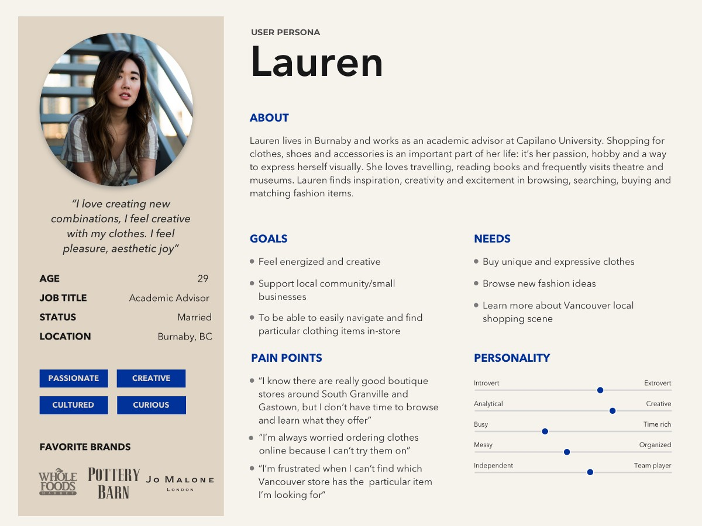

**Scenario for Lauren**

> Lauren recently saw a beautiful pair of jeans by R13 brand in a video of a fashion blogger she follows on Instagram. She didn’t know where to find it in Vancouver, so she Googled where to find this brand, and it showed Nordstrom as the first result. She went there, asked where she could find that brand, went to browse, to only find out they didn’t have that particular jeans model.

> Then she went back to ol’ friend Google and found that exact model of jeans online. Because she ordered those jeans online, Lauren is now worried if they fit and whether she’ll have to go through the hassle of returning it back over the mail. Lauren is now feeling nervous about the possibility of having to return or sell them online.

**User flow for Lauren**

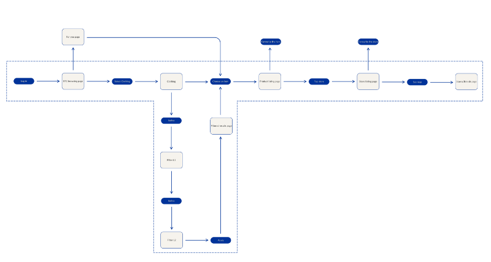

#### Meet Marie

Marie considers how she presents herself as part of her professional self, and wants to be able to curate her fashion catalogue to stay up to date.

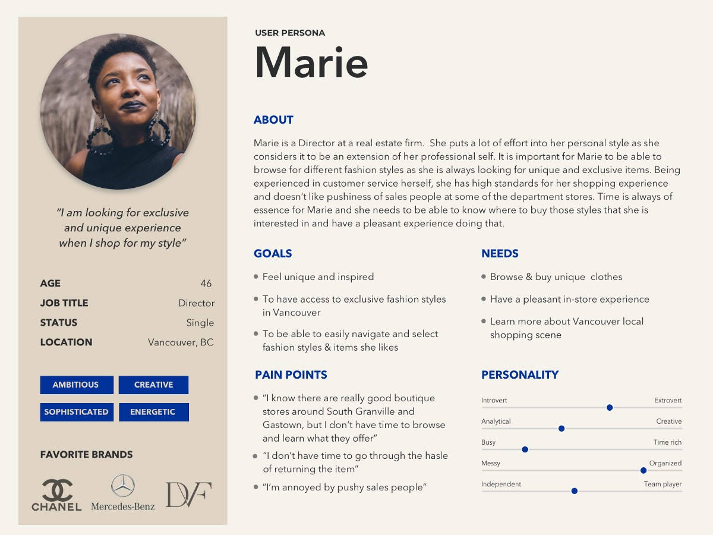

**Scenario for Marie**

> Marie takes her fashion choices very seriously and likes to curate her style on a daily basis. She likes to use STC app for that purpose. Marie is looking for a new dress to wear to an important meeting with stakeholders at the end of the quarter so she is regularly browsing the app to see what options she has available. Marie would like to save a few items and see what’s available in her favourite stores and brands.

**User flow for Marie**

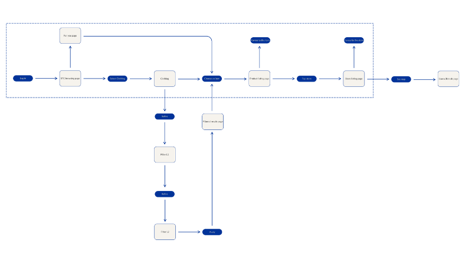

At this point we had most of the planning resources completed to move into the design phase of our design process.


### Design

Using our trusty pens and paper, we got to making paper prototypes of our user flow to begin rapidly prototyping and test our design.

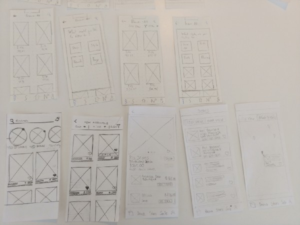
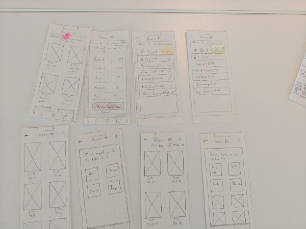

By making paper prototypes we had the chance to test our user flow and MVP feature set of logical issues. We needed to do this to understand where our design failed to meet the expectations of users, and be able to quickly make changes to address those breaking points.

**Testing results and changes**

We got the opportunity to redraw and fix issues with each testing round, we improved the following areas:

*   Restricted filter system to require a pre-filter users need to make a choice on to reduce the total number of menus.
*   Reworked multi selection on the filter menu to included the option to clear or select all based on state.

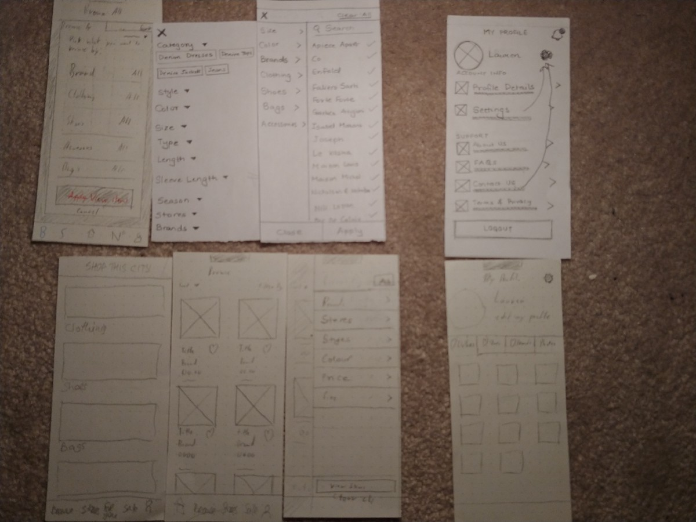

*   Include a current user location the map view
*   Moved personalized recommendations from the landing page to a separate section to reduce the complexity of each section to a single purpose.

#### Mid-fidelity prototyping and testing

Following paper prototyping, we started transferring our design into the digital space to start testing micro interactions like form validation, loading screens, notifications, and the filter menu.

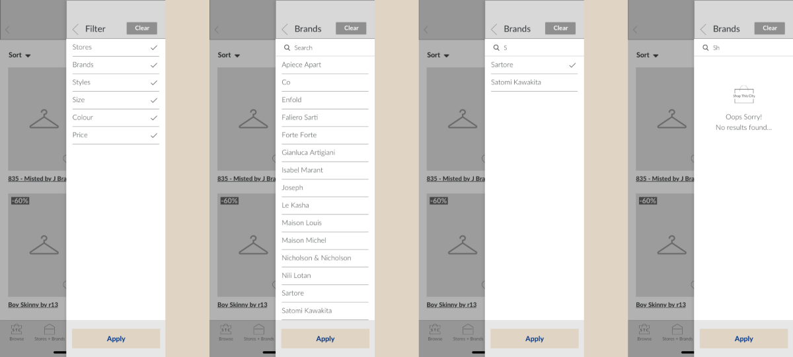

At this point, we as a design team decided to make a shared design library that would house repetitive elements, text styles, and colour styles. In doing this we created a pipeline to transition our mid-fi work into high-fi without needing to stop testing or production of additional screens.

#### High-fidelity prototyping and testing

To turn the UX team’s mid-fi work into hi-fi screens we handed over the design to the UI team and let them work their magic. We took this time to add delight to the prototype by building animations and adding interactivity through button states in the prototype. Doing this let us test a more thorough user experience, and highlight the features of the STC app to new users in onboarding.

<div class="gif-grid">

```grid|3
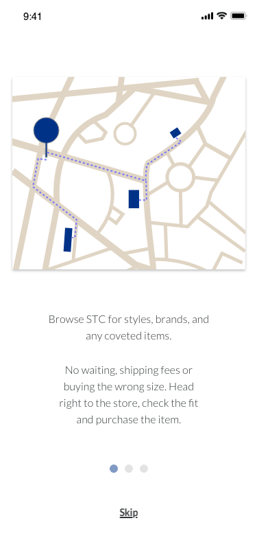
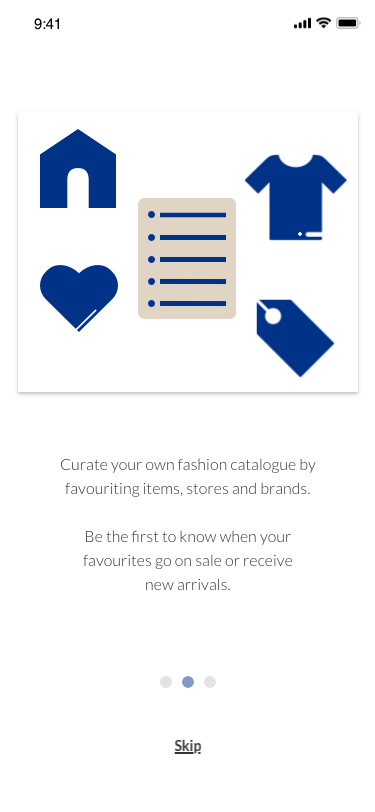
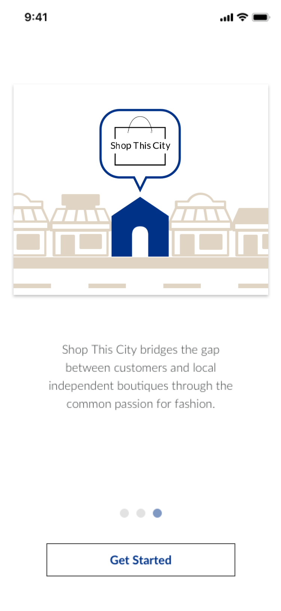
```

</div>

<figcaption>Onboarding Animations</figcaption>

#### Final prototype

Our client was ecstatic with the final prototype and we succeeded as a team in delivering a well-featured app in three weeks of design work.

You can find the prototype on [Invision.](https://invis.io/6DTAJZK5HS8#/377054062_Onboarding_1) (Last updated on Monday, August 12th 2019)

### Future considerations and conclusion

Beyond the MVP scope, we included these considerations earlier and I will reiterate them here:

*   A search by image function
*   Reserve an item that is out of stock in the STC app(dependent on the business relations with store owners)
*   Design a shop crawl feature with more research of the actual STC app.

This project was a great exploration of product design, which to me at this time is working on an existing product to refine it’s ever evolving scope and goal. Shop This City has a powerful purpose and could empower local businesses as well as give the opportunity to shoppers to experience the convenience of browsing digitally and shopping physically.

</section>