<section>

Our client, VitalSines, was in dire need of a redesign for their app iHeart Internal Age. This app connected to the iHeart pulse oximeter, which would be able to let user's track their internal age and walk them through how to lower their internal age.

We were asked to design an app prototype that would improve "stickiness" and inform users of the steps they can take to lower their internal age.

So what's "stickiness"?

</section>

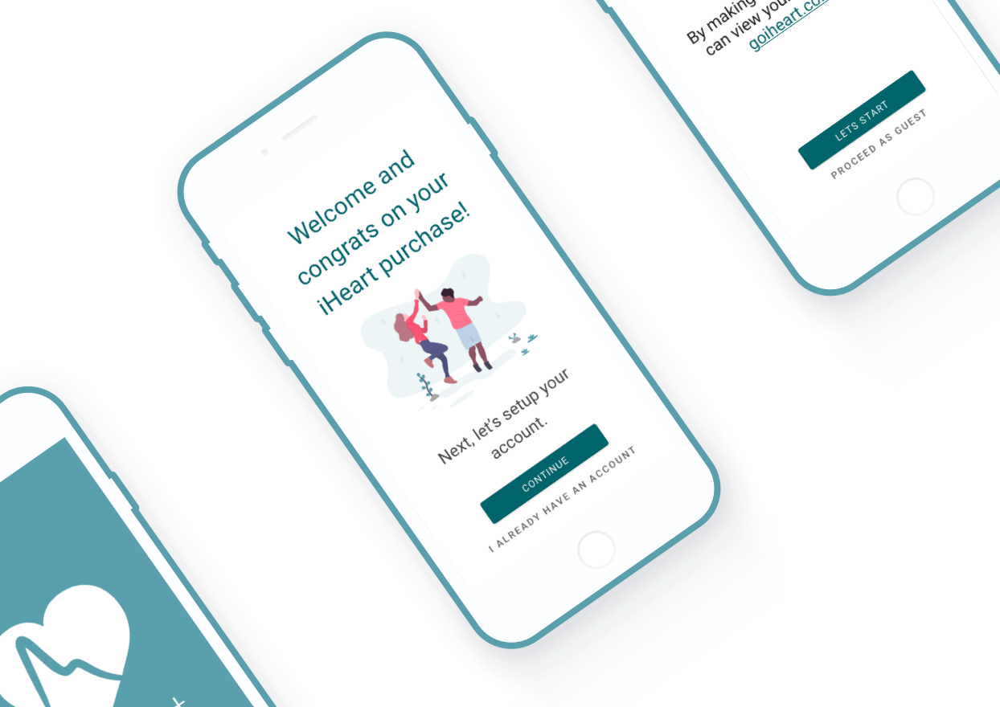

<section>

### The team

The team consistent of 4 UX design students, Annie Fang, Halina Garycka, Saveen Toor, and myself.

### My Role

For this project my roles included:

* Conducting over 30 user tests.
* Discovering our user journey and flow with paper prototypes.
* Aiding in user and competitor research.
* Designing and producing over 40 final screens in Adobe XD.

We had an opportunity to try new tools in Adobe XD and Whimsical boards which were both great for creating quick prototypes and user flows respectively, more on that later.

</section>

<section>

### Stickiness is...

From the client's viewpoint a flaw of the current app is that user's had no reason to stick with the app.

Our first meeting felt very incomplete like we lacked a complete picture of the issues we were tackling, so we needed to find out more.

### Finding out more

We tried to find out what stickiness was by testing the existing app and observing new users try the app out. These methods would let us gain first impressions and record insights into the thoughts during a first time experience.

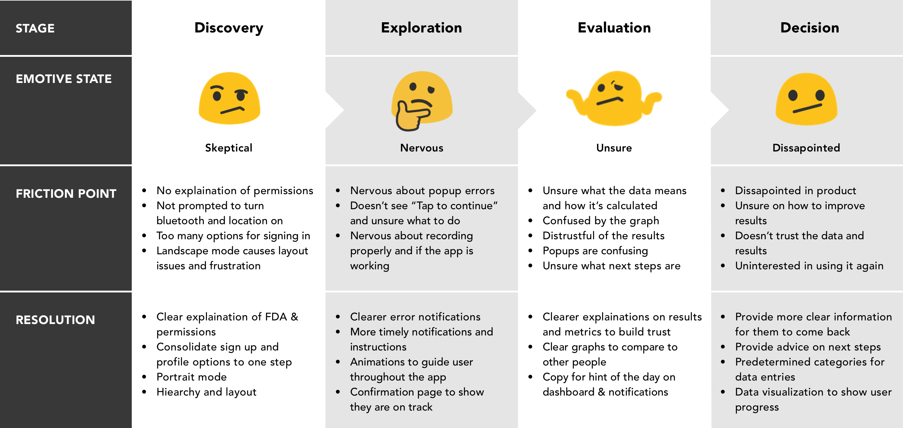

You can view our testing data here: [iHeart User Testing Data](https://docs.google.com/spreadsheets/d/1dUa1tQ5RX6OnZenbSxFr_t1irxuRsiT79A5FG8wGyW0/edit?usp=sharing)

After testing the existing app out and interviewing test participants, we narrowed stickiness to be:

* Users's don't trust what is being shown to them on the device or the app.
* User's leave with more questions than answers after learning their Internal Age.
* Not many reasons to check Internal Age after the first try.

A particular note is that system prompts have no context and ask for sensitive access to device location and bluetooth. These moments scared off users entirely, and would often prompt intervention from us as testers to continue.

With a two week deadline, we decided to focus on a comprehensive onboarding experience that would gain the user's trust and offer footholds for using the app on a regular basis.

</section>

<section class="inverse" style="background-color:#CC5353">

### Overcoming motivation issues

During our research we found that our client had already approached a team from [RED Academy Toronto](https://medium.com/@nilankasandas/iheart-how-old-are-you-on-the-inside-ff18a69ccac2) about a redesign in the past. We were not told about this from the client, and when we asked about it we were brushed off.

This hit the team hard as we found little motivation to continue the project with high energy. We overcame this by deciding to use this as a learning opportunity to try [Adobe XD](https://www.adobe.com/ca/products/xd.html) for prototyping and make something we could be proud of, and maybe have some fun with.

</section>

<section>

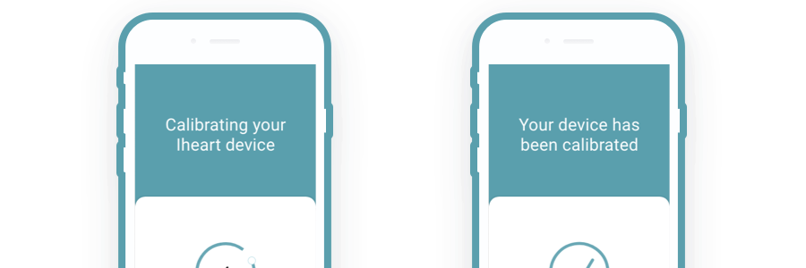

### Gaining trust

From our user tests we had a few quotes that revealed to us these key moments where we could gain trust with users:

* Prepare users with concise information before system prompts appear.
* Offer next steps immediately after a test reading, and encourage further information seeking.
* Clear instructions and more information through each step of the process.

### Setting a direction

>So imagine that Bill has just bought the iHeart app, after his grandson saw it on Dragon’s Den on TV. Excited, Bill has found what he needs to start staying healthy. After Bill downloads and fires up the iHeart app, he is told he is currently older internally that he is. Unable to find information on how Internal Age is calculated, Bill leaves disappointed that the app doesn’t tell him more information on how to lower his internal age.

This is Bill, who was very helpful in contextualizing our research. With his help we decided on a few features to design which are:

* An on-rails guided first time experience.
* Report tracking with visualizations, contextual information on how to interpret results and steps for the future..
* Reminders for continual usage.
* Status updates to inform users what is happening behind the scenes.

</section>

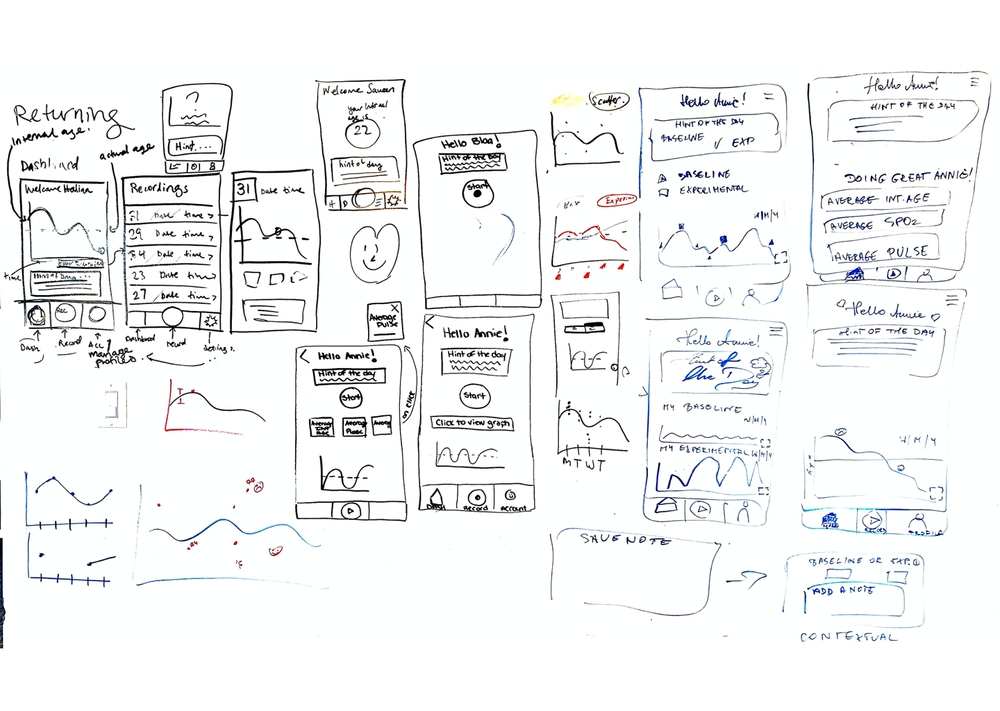

<section>

### Designing features

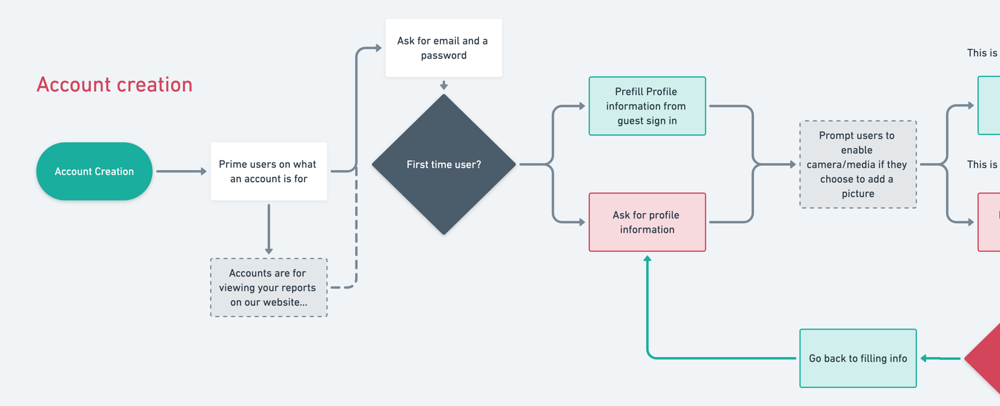

In order to design the features above we mapped out a user flow, making sure to intervene at the key moments from earlier.

A set user flow helped us walk through each step a user would take, and served to be the asking board when we had a question. For example a moment where we didn't have the answer for a question ourselves, became a moment where we raise information in the onboarding experience.

Click this [link](./vsines_userflow.png) to see the full user flow.

### Making a on rails experience

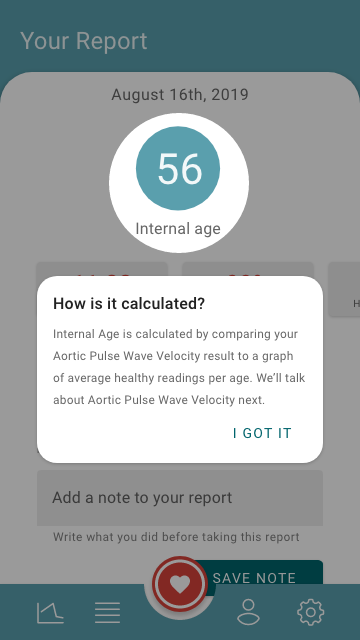

What we wanted was to make an experience that hand held users through their first time using the iHeart Internal Age app, as if we were next to the user explaining each step. To mimic that experience we created a highlighted, step-by-step walkthrough of how to interpret Internal Age results and the steps you can take within the app to lower your Internal Age number.

You can see more of how this happens in the demo app later.

### Redesigning a confusing feature

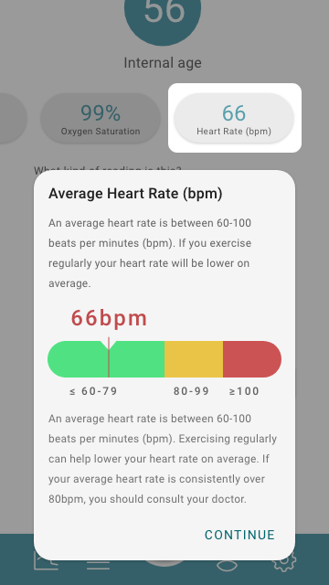

A confusing feature was reporting in the existing app. Existing reports gave plain numbers with no context on what they mean or how they compare to each other.

There was a experimental / baseline mode which had no context, but was intended to let user's compare their baseline Internal Age and an experimental Internal Age based on changes in their lifestyle.

We decided to keep this feature and expand on it by:

* Adding a line chart that could visually compare the two results and way to switch between the two result in real time.
* Giving context to the numbers given, like Beats Per Minute (BPM).
* Visualize their numeric results into charts that can plot their results against the averages.

### Peeling back the curtain

When we found that suspicious user prompts were keeping first time users from even trying the app, we knew we needed to bring forward what was happening behind the scenes.

We primed users with information for system prompts, giving them ability to make informed choices and feel like they are in control.

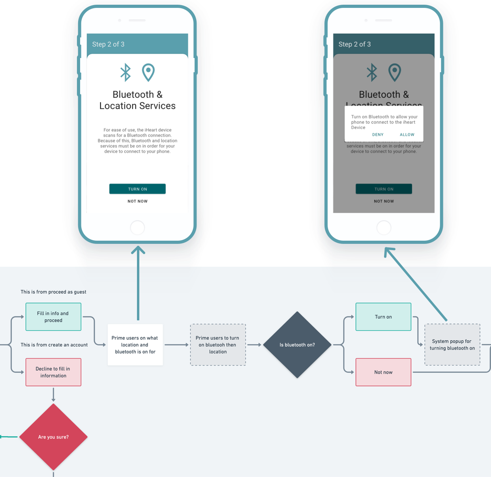

### "What is going on?"

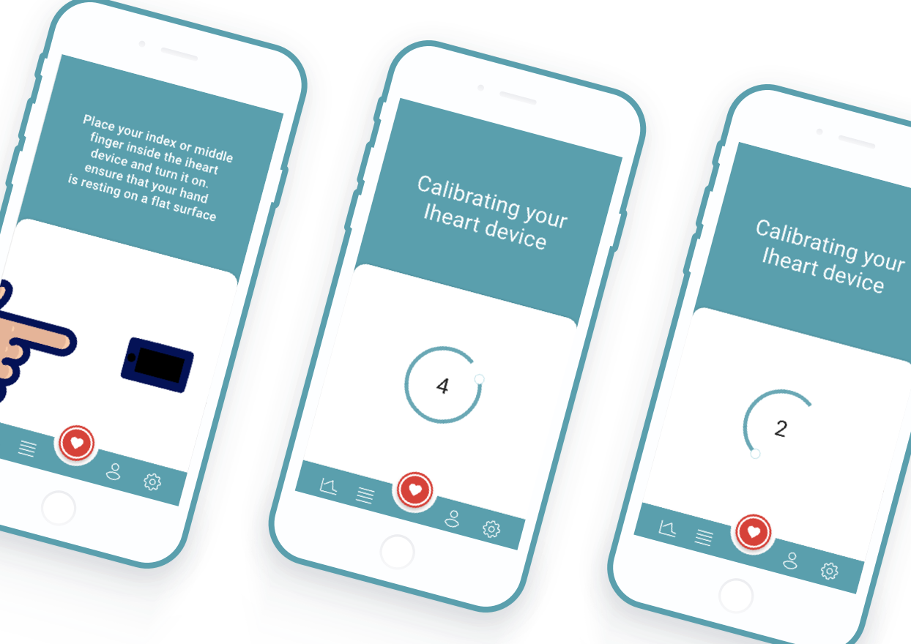

To keep users in the know about what is happening in the app, we raised clear instructions on what to be doing and what a user is waiting for when using the app.

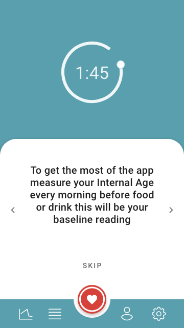

In order for best testing results, the test wanted users to rest for two minutes before testing. This is reduce variation from things like an irregular heart beat if they've been running. We added small delights to keep users busy during this time with the option to skip if they have not been active recently.

</section>

<section class="inverse" style="background-color:#5A9FAD">

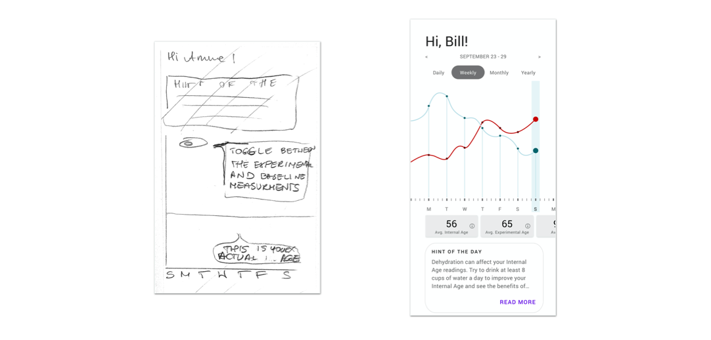

On the dashboard screen design, we initially placed the hint of the day first and above the fold and included the toggle to switched between experimental and baseline results. With feedback of the visualization being the most interesting and attention grabbing part of the page, we moved the hint of the day and combined baseline and experiment to show on the same line graph.

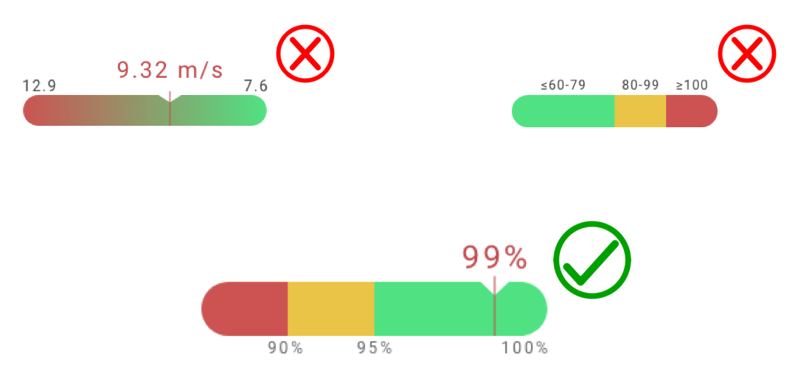

We were unsure how of how to represent how a result compares to the average. What we found was the visualization needed clear breakpoints of where the result stands, and an indicator to show where the result is standing.

</section>

<section>

### What I learned

>It's hard to stay motivated.

As mentioned before we ran into motivation issues mid way through the project. I learned to make lemonade, and turned the situation into a moment to learn new skills and tools. The team was thankfully onboard and motivated to try new tools out and we delivered a successful prototype.

>Onboarding makes or breaks it

The initial tests of the existing iHeart Internal Age app told me I can't use this app. The app had no way to get users into the app or keep them using it through reminders or general interest in lowering their Internal Age. This became our North Star, where we could add value to the product.

### Prototype

You can view the prototype we made at this [link.](https://xd.adobe.com/view/7acf1975-bec5-4959-82f6-37257c7644a5-2f9c/?fullscreen)

The prototype covers the first time use of the iHeart Internal Age app and a guided walkthrough of interpreting the results of a report. We had time at the end of the project to experiment with line chart visualizations that are animated.

Many thanks to Annie, Halina, and Saveen for coming together for this project.

</section>