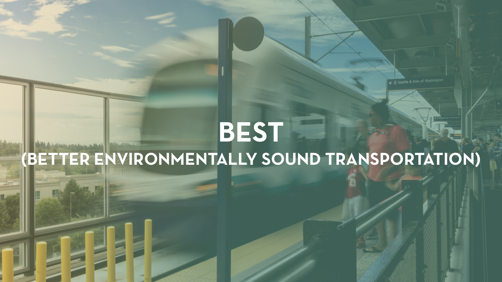

#### Team members

Emil, Marie, Kyle — UX  
Patrik, Ly — UI

#### Introduction

For my next client project, I was placed in a five person team with two UI members and two UX members. Our project goal was to design and build a new **responsive website** in **three weeks**.

For the UI team this meant:  
_Creating a visual style.   
Conceptualize potential new logos for BEST’s brand.  
Creating a collaborative set of Sketch Documents and Symbol Libraries.  
Deliver a set of high fidelity wireframes to use for prototyping with InVision._

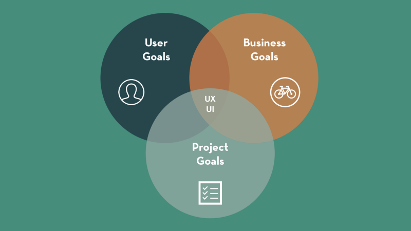
A UI/UX design is somewhere between user goals, business goals and project goals.

#### **Establishing Goals**

As a team with the client we needed to establish the project goals, user goals, and the business goals. From our first meeting with the client, we established the project goal to be design a website that tells the story of BEST to existing and new clients. The business goal was to offer sales of their services, recruitment for volunteers, and attract sponsors from other organizations. Our user goals were find information about BEST and their programs and offerings, although this was finalized after some contextual research by our UX team.

In the middle of these goals we had to design a responsive experience that spoke about BEST’s history and build the confidence to join BEST’s mission.

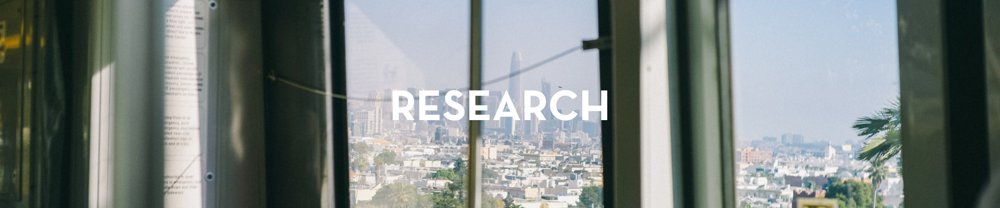

#### Creative Research

For the UI team we started this project by researching competitors in the same brand space which are **local nonprofits** and “fun” companies with some **history** to them. Some examples of what we found are from the David Suzuki Foundation , The Bloom Group , Ecotrust and Modo. The common trend between these examples is the use of imagery to represent their cause and brand. We used these as inspirations of visual style to pursue two art directions to present to our client.

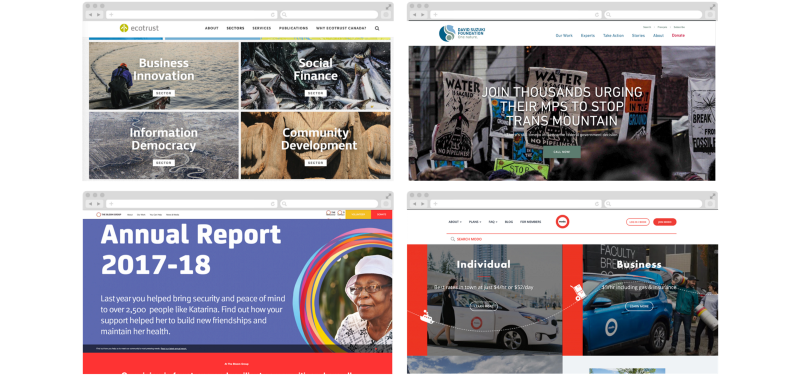

We did this to start building a test for our client called a Gut Test which we used to gauge their reception to different colour palettes, visual styles, and mood images. Below are some of the images from the Gut Test with the reactions from our client.

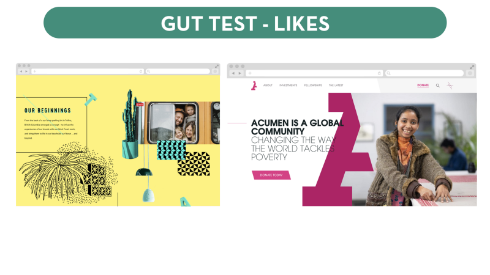

Our client’s reaction to the Gut Test told us that he liked visuals that represented inclusivity and community, repetition of brand items throughout a page, and playfulness with the visual elements.

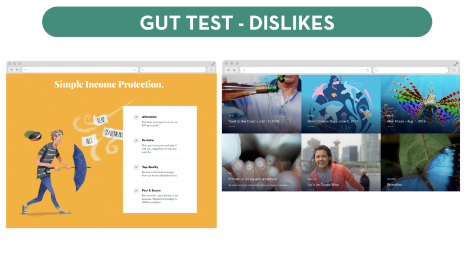

He disliked cookie cutter template visuals, rigid or cluttered visual spaces, and any implications that the brand is basic or boring.

> Repetition of brand, inclusive community, playfulness.  
> Cookie cutter, rigid and cluttered visual spaces, boring or basic branding  
> **Together, Sincere, Fun**

These were results of the Gut Test and the mood keywords that we came up with used these to purse two art directions called Vibrant Communities and Urban Action.

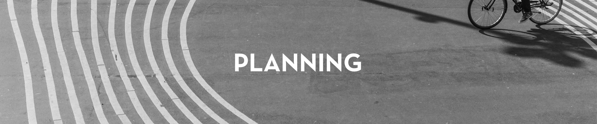

#### Why

At this time we as a UI team we came up with a **why** for BEST’s brand which was:

> To build thriving communities through promoting sustainable transportation solutions

This **why** informed the space, shape, movement, and colours we picked for the Vibrant Communities and Urban Action art directions. To explore these however we curated two moodboards for each art direction to better align our sense and clients sense of these two art directions together.

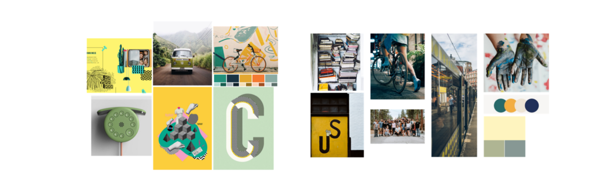
Left moodboard is for Vibrant Communities, Right moodboard is for Urban Action

The moodboards for each art direction explored some of the colours, space, shapes, and movement flows that we wanted users to get a sense of. From these as well as the design inceptions we could make style tiles for each art direction.

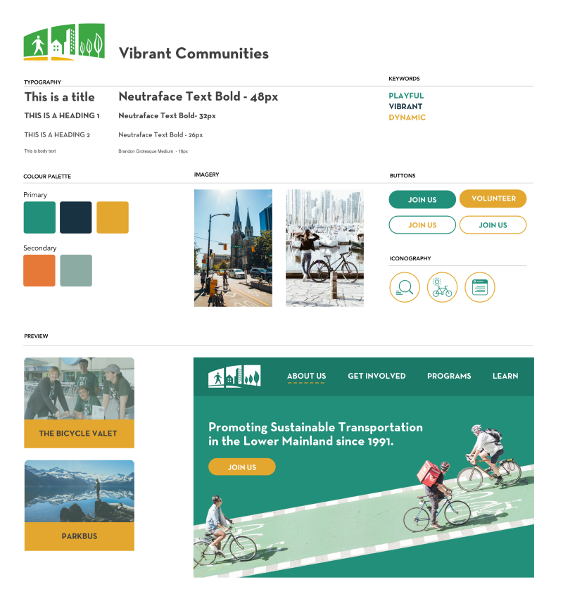
Vibrant Communities Style Tile

The Vibrant Communities style was designed to be **fun and playful**, with overlaid cutouts like an old paper collage. We chose fully rounded corners on clickable visual elements to feel friendly and the least hostile. The typeface Neutraface was picked for it’s novel history and vintage inspirations.

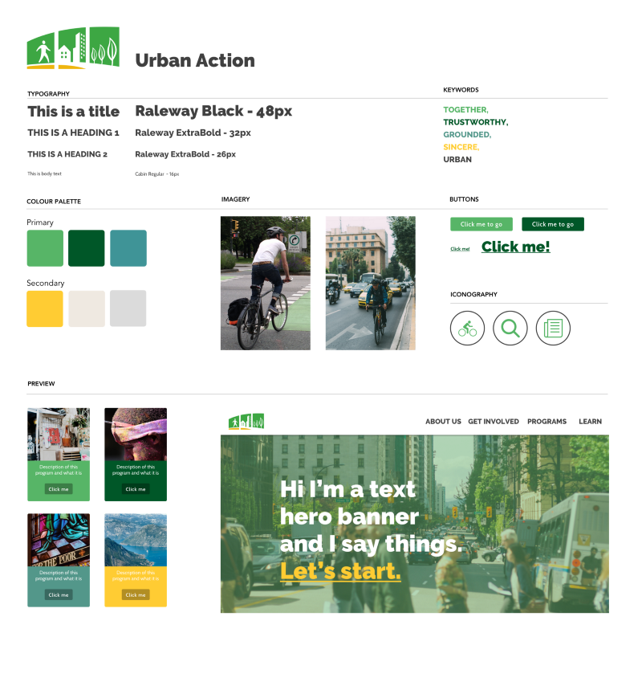
Urban Action Style Tile

The Urban Action style was designed to be **modern and bold**, with more nature related colours such as green and blue. We chose slightly rounded corners for square elements to feel less sharp and hostile.

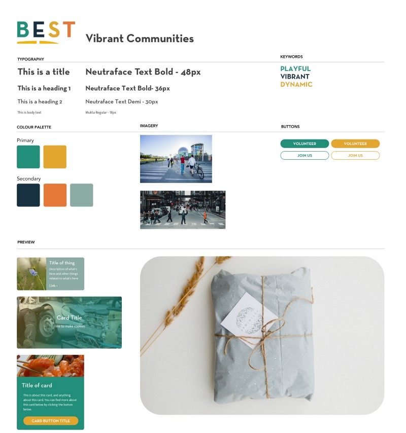

After presenting to the client, he picked out elements that they wanted from both and left it up to us to combine them. The overall direction we got from our meeting was that BEST’s visual style should tell it’s **history**, which for reference was started in 1991. We made a style tile using the colours, button styles, and typefaces from Vibrant Communities as they have the **bold impact** that BEST wants.

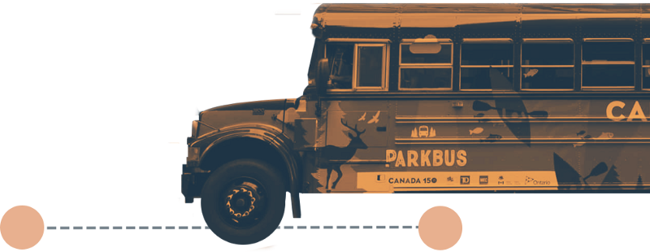

Then we combined those visual elements with images to be able to show the raw visual connection BEST has with the community. We applied a duotone filter to the images to make a visual representation of BEST’s history, having our images feel like an old paper collage. By showing images we can represent some the direct impact BEST has and combine it with additional branding with a gradient overlay. This **reinforced** the history of BEST with **vintage inspired image cut outs** dotted on our main pages.

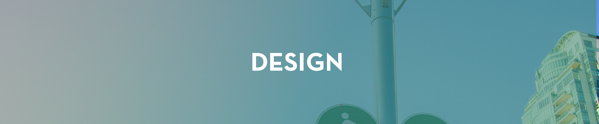

#### 8px Grid

As a part of collaborative work we chose to use a pixel grid to enforce consistency between our wireframes as a design team. Some of the benefits of using a pixel grid are faster production, similar visual styling across all elements, and easier to setup a hierarchy between elements. A key learning lesson from using a pixel grid is having a **central truth** which reduces **decision fatigue** on us as designers.

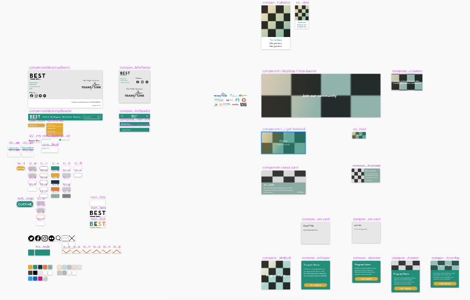
Screenshot from our Design Library

#### Design Library

As a part of collaborative work we chose to make a visual design library in Sketch. In the library we put nested Symbols of all the major repeating UI elements like the header, banner, footer, text styles, layer styles, and buttons. This design library aided in enforcing consistency in our designs and like the pixel grid reduced decision fatigue once we began production of high fidelity wireframes.

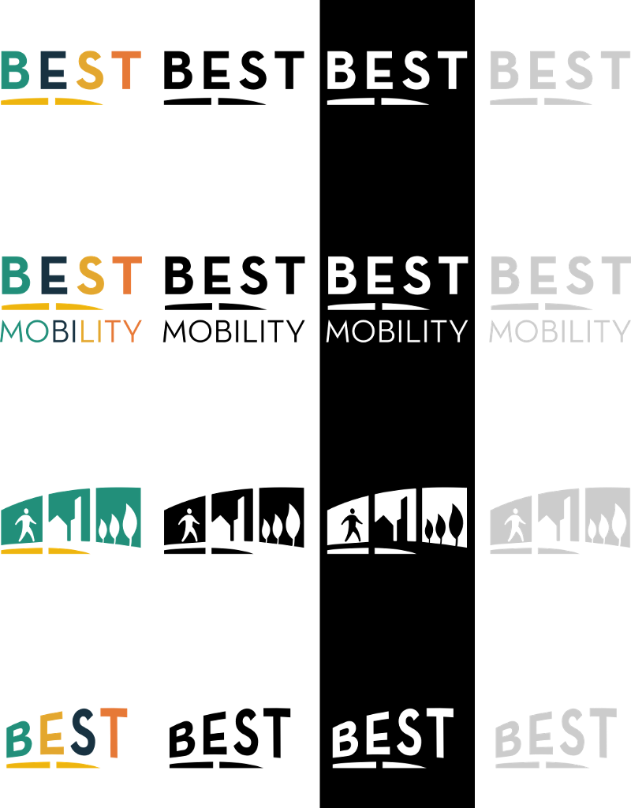
Some of the process Logos we finalized on presenting to our client

#### Logo Work

We conceptualized logo designs for BEST with the caveat that the logo may not change due to needing to be passed by the board. We started with sketches that had a broad visual reach, modifying the type and attempting to represent all the values of BEST at the same time. This was challenging and in our client meetings we were directed to simplify the existing logo instead of completely redesigning the logo.

We presented three final logo options to the client and designed with one in mind when making our high fidelity wireframes. The final choice of logo is being left up to the client.

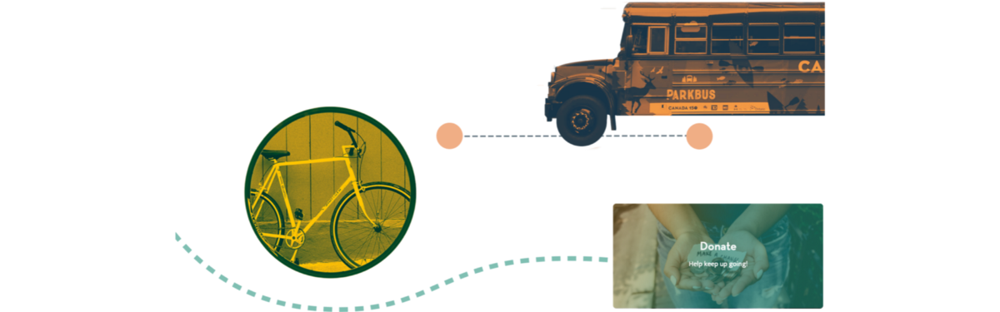
A sample of some of the visual elements we repeated throughout the design

#### Homepage and About Us Visual Elements

From our style tile we decided to use a visual style similar to aged paper cutout in a collage to call back to the history of BEST. We repeated visual elements like the newspaper cutout, the wrench, and schoolbus throughout the main pages of the website to reinforce that feeling.

We also used a small amount of illustration to represent transportation with street lines and crosswalk lines as additions to the vintage cut outs.

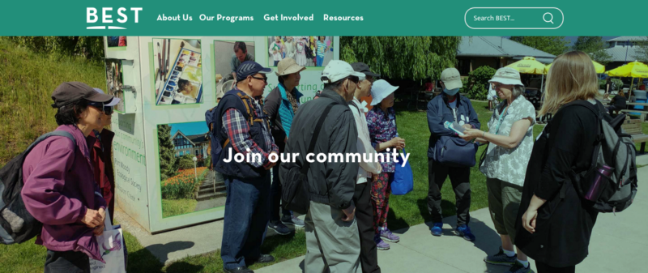
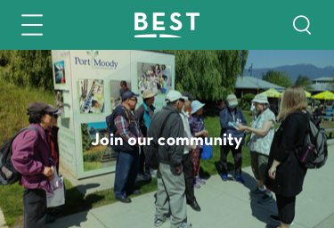
Sample of how our banners scale across devices

#### Banners across pages

For our banners across pages we choose to use large full width banners, displaying curated images with a gradient overlay that uses the brand colours. Using curated images, we can carefully reinforce the brand’s values at first glance when a page loads in and this method also scales well responsively from desktop to mobile screens.

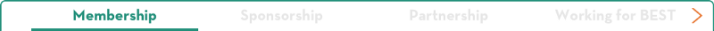

#### Scrollable tabs

UX decide used scrollable tabs to condense pages vertically and make use of virtual horizontal space to avoid having extremely long pages of content. To visually design this we looked at existing tab design paradigms like Material Design and adapted the look and behaviours to match a users expected outcome when seeing this interaction. We chose not to use different colours than our main brand colour to avoid high contrast between the text and the border of the entire tab container.

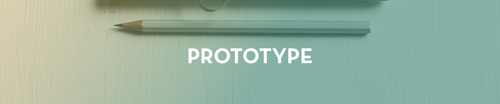

#### Prototype

You can view the desktop prototype at this link: [https://invis.io/SHSF0T8ANCW](https://invis.io/SHSF0T8ANCW)

You can view the mobile prototype at this link: [https://invis.io/TQSF0T0SYX5](https://invis.io/TQSF0T0SYX5)

The prototype walkthrough was made by the UX team, where the UI team helped make screens with modifications as needed. We worked fairly closely at this point in order to make visual changes quickly as the UX team came across errors and problems in testing and in quality control.

#### Conclusion

This project was a learning lesson in setting foundational collaboration processes so that the entire group is operating on the same wavelength.

We had issues surrounding consistency between the UX wireframes given to the UI team, and to solve this we implemented the 8px grid for all members to follow. In addition to this we learned to make and organize a design library in order to reduce decision fatigue which we came into halfway through the development of the prototype. In the future I can take this into my next projects and achieve similar effects.

In terms of visual design this project was not really my preferred visual style which made for a great learning project to work outside of my comfort zone. Ly was a great help in dictating the ground rules for making a cohesive visual style that represented history and fun, with the cut outs and illustrations.

For the future I’ll be able to take the lessons here and be able to put forward some of the lessons to my next work groups.