<!--  -->

> When you see the words “bully-free website”, what do you think of and what do you expect to take away from such a place?

In this project we researched, designed, prototyped, tested, and iterated on a website for BullyFreeBC(**BFBC**) that focused on **acquisition** and **retention** of new members for BFBC’s relaunch.

We did this in **three weeks**, making **50+ high fidelity wireframes** for both desktop and mobile. I was on the UX side of this project doing research, planning, information architecture, wireframing, user testing, and prototyping.

This project ended up being about designing contrary to **existing expectations of users** and meeting the business goals within those **constraints**.

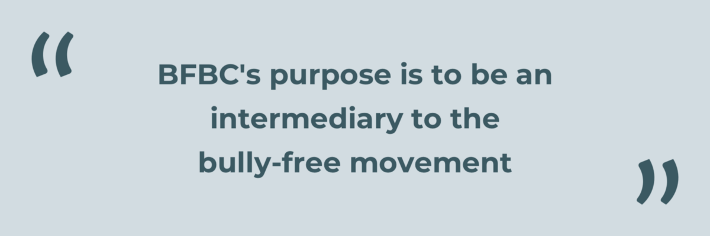

### Understanding the challenge

**Who is BullyFreeBC?** BullyFreeBC is a non-partisan, non-affiliated organization that is undergoing a relaunch of their website and rebuilding their network of professionals who want to enact social change.

From our first client meeting we learned that this means:

*   BullyFreeBC can offer bully-free advocates **templates** and **information** to help them start anti-bullying projects **on their own**.
*   BullyFreeBC’s aims to **connect like-minded advocates** with their network.
*   BullyFreeBC **_does not offer help services_**. People looking for help will not be able to get advice or counsel from the organisation.
*   BullyFreeBC cannot **professionally** address how to deal with bullying.

#### Constraints

From this launch pad, we as a team made constraints that we would use to guide our design decisions going forward into this project. Those were:

*   BFBC has an **intermediary** stance.
*   Past victims of bullying may visit the website which meant the website must **feel** safe.
*   BFBC has planned two sides to the website, one for the general public and one for the membership. We will focus on the **general public**.
*   A focus on **creating documentation** to help make actionable change in workplaces.

These guidelines were crucial to the feel of the design as the audience involved **people at risk** which need to be treated **with care**.

**When you see the words:**

> **Bully-free website**

**What do you expect?**

We were unsure of this and using the above question as a research hypothesis, our team looked at:

*   Who are the main users of the site?
*   What is a bully-free website?
*   How do they expect to navigate a bully-free website?
*   How do they currently navigate the existing website?
*   What encourages or discourages joining BFBC?

To answer these questions we sent out a survey to potential users, conducted interviews with past members of BFBC, and tested the existing website with potential users.

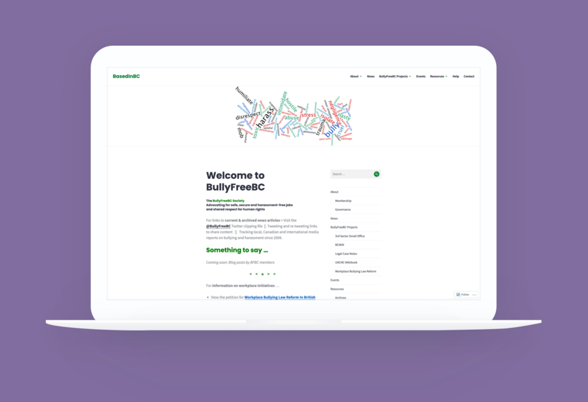

#### What we found

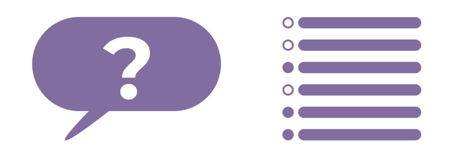

From our interviews with past members of BFBC and performing contextual inquiries of the existing BFBC website, we learned:

*   BFBC has **low exposure**, people can’t join what they don’t know.
*   Of the many reasons they joined BFBC, chief amongst them was to **make an impact**.
*   **Credibility** and historical precedent will persuade individuals to join.
*   The existing website is too **cluttered** and **disorganized**. It feels cold and unwelcoming, and users can’t **trust** it due to **lack of visible social impact**.

A common feedback between our three methods of user inquiry was that people **expect to get help** when they visit a bully-free website. This posed an interesting difference between what BullyFreeBC is offering and what our users expect from the domain of anti-bullying.

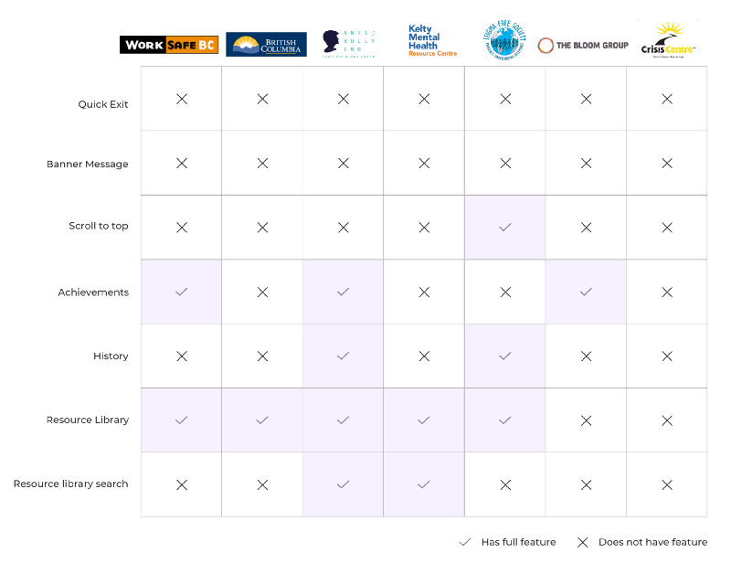

Especially when comparing to other organizations in the domain of anti-bullying, the general offerings of an anti-bullying website should include **services** like: one on one counselling, help hotlines, and solutions to bullying problems.

What BullyFreeBC is instead of being a service provider:

> **BullyFreeBC is an intermediary to an anti-bullying moment, and that BullyFreeBC needs to exposure and credibility to build up a network of individuals that can become a part of that movement.**

### Managing User Expectations

So how do we as designers bridge the gap in **expectations** of users? How do we embed the idea that BFBC is not a traditional anti-bullying website, that BFBC is an intermediary to a network?

We started our process by processing our data from surveys, interviews and contextual inquires into **key insights**.

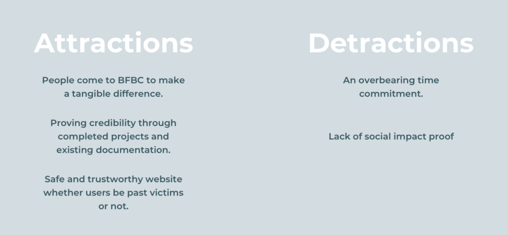

During this time we made user journey maps and affinity diagrams of our data to help make sense it all. We took away these expanded data points:

#### What causes people to join BFBC? (Attractions)

> **People come to BFBC to make a tangible difference.** We need to show them that BFBC is worth their time and effort to join.
> Proving **Credibility** through completed projects and existing documentation. These can help persuade people to join BFBC.
> We need a **Safe and trustworthy** website whether users be past victims or not: They should feel invited and be able to navigate easily.

#### What stops people from joining BFBC? (Pain points)

> An **overbearing time commitment**, both in reading **too much text** and project participation.
> Secondarily, they also found a **lack of social impact proof** as sign that the organization may not be what they say they are.
> **So how did we use these insights to answer our user’s gap in expectations?**

At this point we still didn’t fully understand our user, and instead made a user to help us as a design team. We made a persona, a fictional user, to bounce our insights off of to see if our assumptions were correct. So meet Michelle:

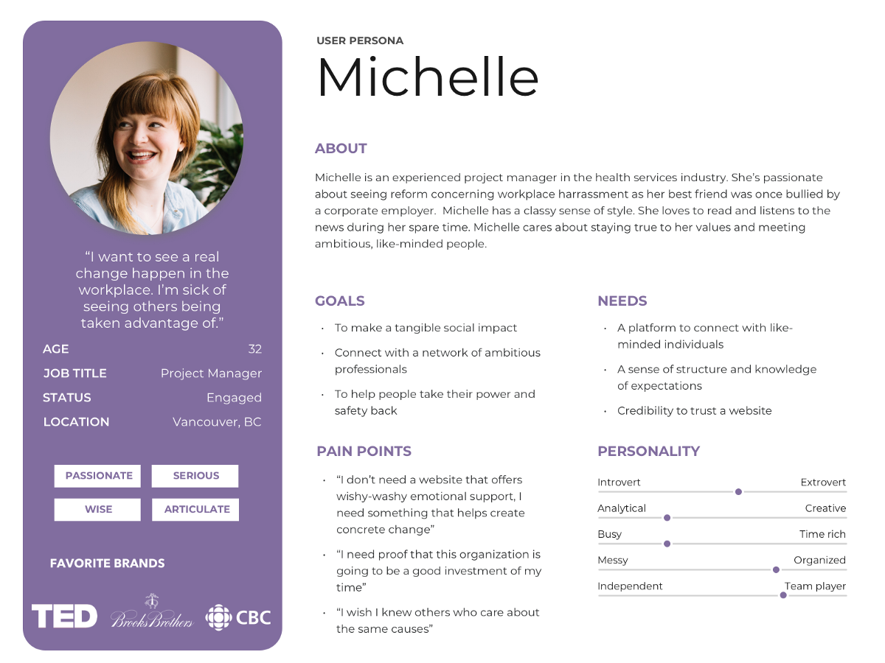

She’s the super loyal type, you can always count on her. Ever since her best friend was bullied at her job, she’s been really passionate about seeing reform concerning workplace harassment.

In Michelle’s life she’s had friends close to her bullied and co-workers in the workplace bullied. From this she is motivated to make changes so that doesn’t happen again.

#### Imagine this…

Michelle is researching, trying to find an organization that can help her get started with making a difference at her own workplace. She finds BullyFreeBC through Google but the current website doesn’t **highlight** any of the organization’s history or past successes. Unable to tell if its **credibility**, Michelle ultimately leaves the website. She’s frustrated as she’s **wasted** a lot of time researching but still hasn’t found a good community she can **trust**.

This is what her experience on the current BFBC website is like

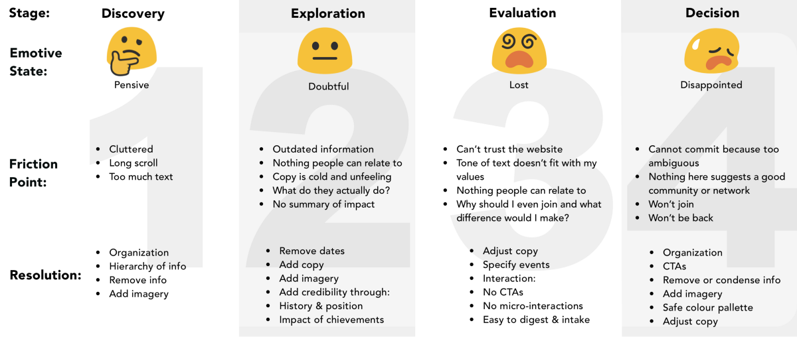
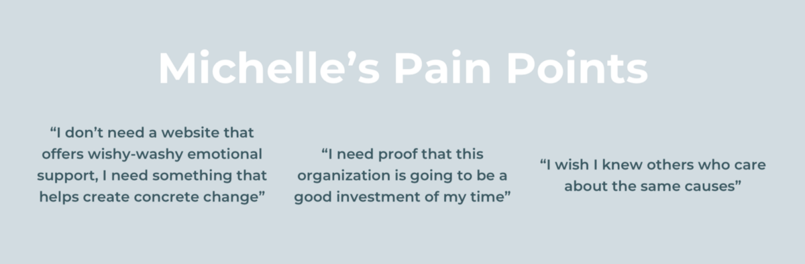

We used Michelle to guide the feature requirements of the website and to remind us of the expectations that our users have. Michelle needs to have her pain points address which we choose to do through:

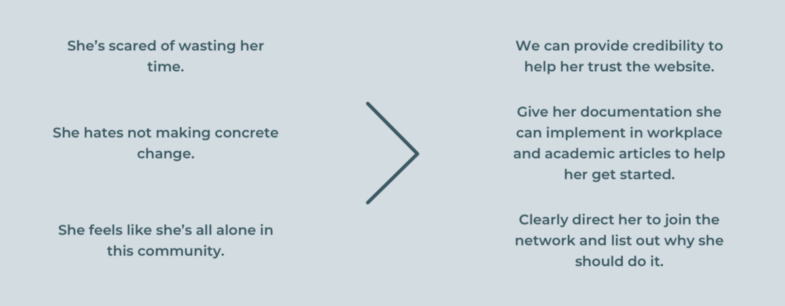

The absolution of Michelle’s pain points drove a feature set that would satisfy her needs and the needs of our client.

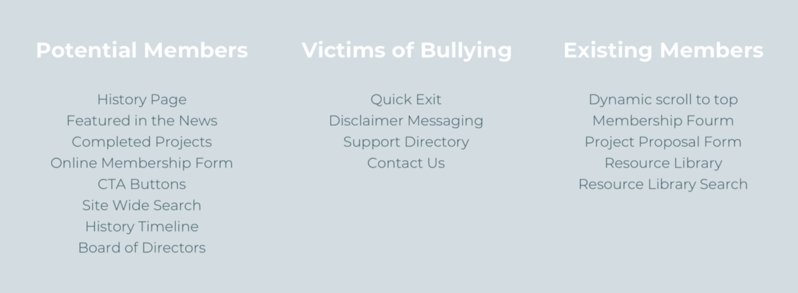

Our feature set can be split into who they mean to address: potential members, victims of bullying, and existing members.

Features like a **quick exit button** and **disclaimer messages** are meant to answer the needs of our client which as an intermediary, need to direct people to the proper resources.

Disclaimer messaging needs to alert users to the fact that BFBC isn’t a service provider. This message should **funnel** users who may be victims of bullying towards the help directory instead of the resource library or somewhere they don’t need to be.

**Dynamic scroll to top button** helps user return to the navigation bar when they are deep in the text heavy resources.

> For potential users who may be victims of bullying or stuck in an abusive situation, quick exit can save a life.

Features such as **achievements page**, **current events** at BFBC, and a **resource library** are for our potential users. Showing off the accomplishments of BFBC in the wild and showing growth to potential members builds the credibility of BFBC as something they can contribute in and grow as bully free advocates. Membership calls to action (**CTAs**) on each page drives membership acquisition.

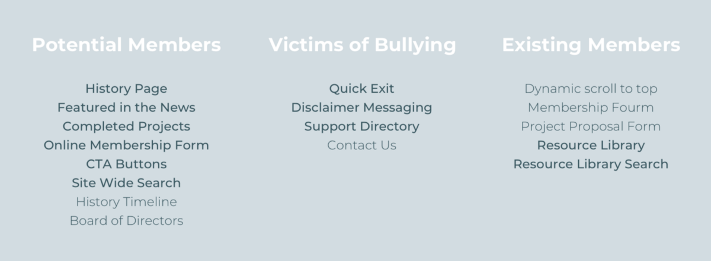

The features we chose to implement became our **Minimum Viable Product**, our MVP. This MVP needed to satisfy early adopters of BullyFreeBC and not dive deep on all of the possible features BFBC could have. The features that we did not cover here will be kept in mind for future launches of the BFBC website.

#### Moving from feature sets to user flows

With our feature set made, we could begin to plot out potential journeys for Michelle and those who need help. We envisioned two main paths that users entering BFBC would accomplish, one highlighting Michelle’s journey towards joining BFBC and the other quickly directing those in need of help immediately.

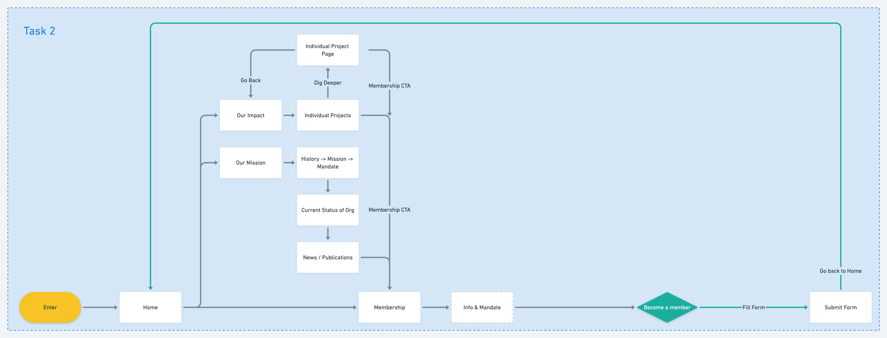

When it comes to Michelle’s task flow, she wants to implement social change.

The home page gives her access to viewing information about BFBC and impact through projects, which open up to more information pages.

Throughout her journey she will encounter several **CTAs** that ask her to consider becoming a member, channeling potential members like Michelle towards membership. This is to achieve our goal improving **acquisition** of members for the organization of BFBC.

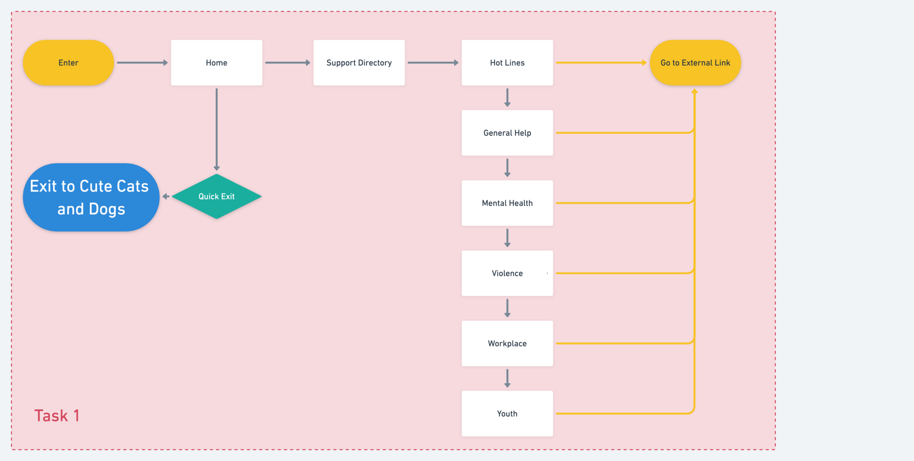

For those that need help immediately, the homepage has a prominent support directory link that takes the user to external support services. On that page itself, there are in-page hotlinks to hotlines & resources which take users out to external websites from there.

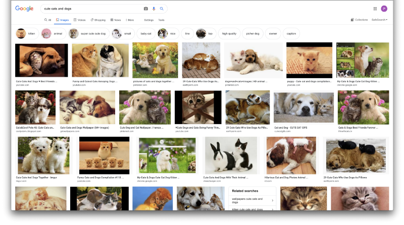

If this user finds themselves in a potentially dangerous situation they can use the quick exit button to find cute dogs and cats.

#### Prototyping and iterations

Remember the question posed earlier?

**When you see the words:**

> Bully-free website

**What do you expect?**

All of our research and planning leading up to this point, told us our experience needed to be different from a **traditional anti-bullying** **website**.

Being different to a traditional anti-bullying website meant that we wanted to communicate BFBC’s message of **advocacy** primarily and to **offer help** secondarily. Additionally the tone of voice should be stoic and not be overly supportive in order for BFBC to be experienced as an intermediary instead of a help service.

So going into our first prototyping phase we wanted to test if our assumptions of what our user flow were on the right track and if our labels for each page matched BFBC’s tone of voice.

However let me side track you for a moment and present you the final high fidelity prototype.

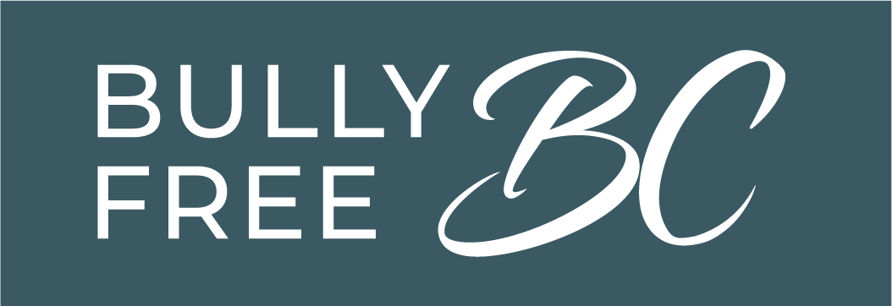

### Hi-fi prototype and Mid-fi Walkthrough

You can find our high fidelity prototypes online:

[Web Prototype](https://invis.io/XUTP2D373MS)

[Mobile Prototype](https://invis.io/CBTP2HBDWXK)

I’ll walk you through a simplified version of Michelle’s journey through the website using the mid fidelity wireframes.

For now, you are:

These prototypes were presented to the client, walking through the journey of Michelle on the web prototype and our potentially in distress users on mobile. I’m showing this before I talk about the low fidelity prototypes to give a frame of reference for what I’ll be referring to in the next part, iterations.

#### Low fidelity prototype iterations

Our initial prototypes grasped at the **core functionality** of what we envisioned, using boxes and simple labels to direct testers to where they would be going next.

Early testing with paper prototypes helped us re-word our headings. If you remember the question from earlier again,

> We wanted to constantly test what our user’s expectations were and see of our designs matched those expectations.

For example, we’d initially named the library “resources” but the word resources had users unsure of what to expect when asked — resources can be anything.

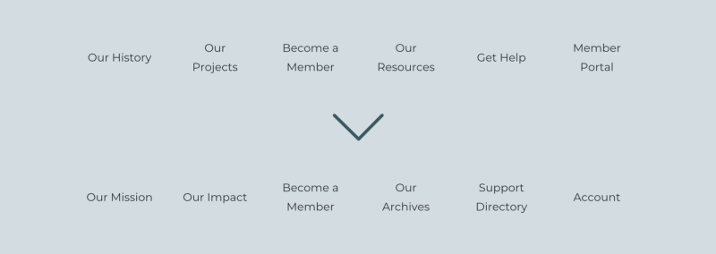

We renamed that to Archives which makes it clear that it contains formal documentation.

Labels changed from friendly labels into stoic labels to ensure our navigation had clear purpose. Feedback from our testers gave us the impression that our initial run of labels gave misleading expectations, for example Our Resources gave the impression that we (BFBC) offered resources or services.

This type of relabelling occurred throughout the testing process all of our labels changing in some way as you can see above.

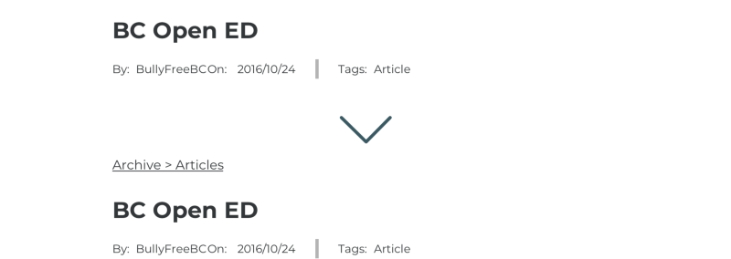

We also added Breadcrumbs within the archive so users can return to their last few research points, as two of our testers mentioned aloud that they were unsure of how to get back to what they were researching.

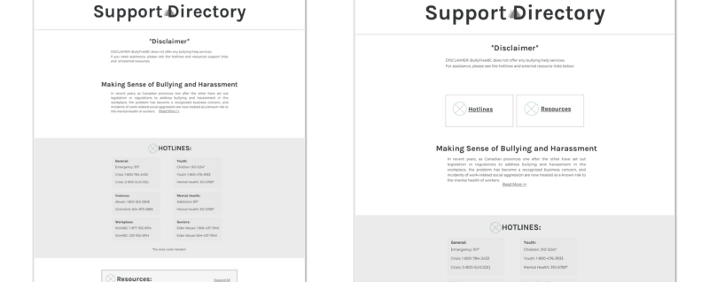

On the help page, users originally had to scroll a little to see the bulk of support links — this ended up defeating the entire purpose of page. We changed it up to include two buttons at the top that scroll a user to the required section further down on the screen.

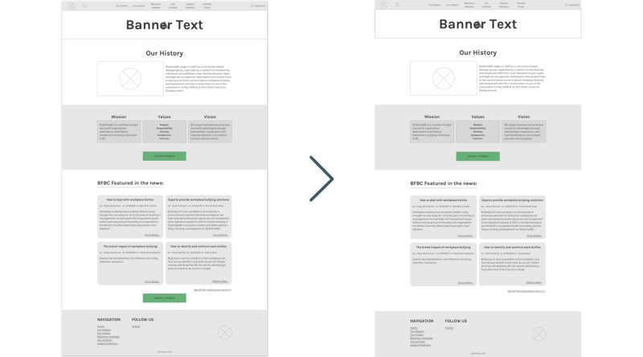

Finally, on the about page, we originally had 2 become a member Buttons. Users said they’d be more likely to select something if it was right after the introduction. As the news section draws their attention away from the bottom button.

We took these testing notes and changes into the digital world, by making wireframes in [**Sketch**](https://www.sketch.com/).

#### Mid fidelity prototypes iterations

After we built out our wireframes in Sketch, we tested again with them with a focus on the **content** of the pages and with the logical flow of more detailed components. For example like our quick exit button.

Because quick exit has to be easily **accessible**, we looked at general conventions for where to put the button on screen. Conventionally on Windows computers close is on the right and most users on phones are right handed, so we wanted to place it on the right.

> The problem is, search is also conventionally on the right.

If we put them together people in a hurry to quickly exit may **accidentally** click the search button, therefore quick exit should be **isolated** from other buttons to avoid accidents.

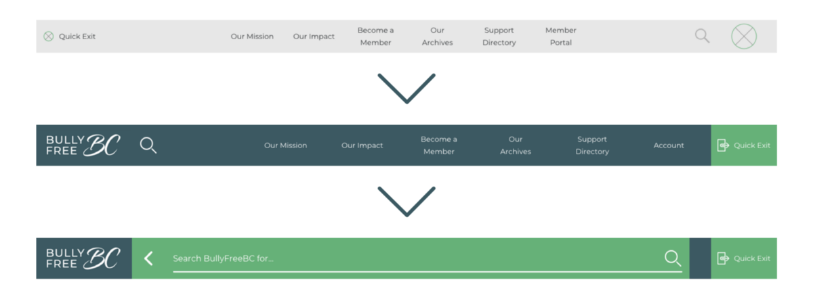

We ultimately put search on the left, user testing told us that users themselves liked seeing quick exit prioritized and while it’s weird to see search on the left users weren’t too unhappy with it and could still find it.

Tapping on the search icon will expand it to a full field that can be used to put your first search input in.

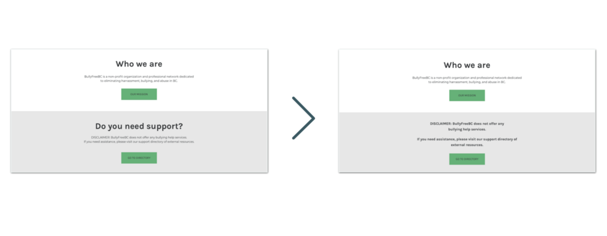

The original idea was to redirect people who need help as soon as possible but we found people **weren’t** **reading** the disclaimer at all.

> All they saw was “**do you need support”**.

We took away the title to make sure users actually read the disclaimer before clicking the button. This way, they know what to expect should they continue to the directory.

From here we passed our wireframes onto our UI team who made the project come together with the branding, style, and tone of voice for BFBC. You can see how they came up with the branding and tone of voice here:

[Andrew Macdonald's BFBC Case Study](https://medium.com/@andrew.nwmacd/cc0883e58e86)

#### Side note on our process from mid fidelity to high fidelity

To make the process easier for both UX and UI to work in tandem, I found a neat Sketch plugin called [Camilo](https://medium.com/makingtuenti/camilo-our-tool-and-technique-for-one-click-brand-change-in-sketch-52-2060ae4161ae). This plugin let us work on the user experience and the user interface at the same time, instead of needing pass our work back and forth.

By making two wireframe files and different shared library files, we could make our mid fidelity wireframes using a shared UX library and have the UI team work on those wireframes as they came in on their own version of a shared UI library. Then when we finished a wireframe it could be transitioned into high fidelity with a click of a button and visual elements repositioned as needed.

### Future UX considerations

In the three weeks we **researched**, **planned**, **designed** and **prototyped** a website for BullyFreeBC’s that focuses on an initial launch catering towards **acquisition** and **retention** of new members.

For future launches, we envision building out the **members only features** of the website like a members forum and to expand on the current ongoing events at BullyFreeBC to further build **credibility** to potential members.

### My thoughts and final remarks

> After our initial client meeting this project felt like wading through mud.

At the beginning of the project, our understanding of the client needs felt like we were restricted and that we had no foundation to build on top of.

As we worked with each other and with the client, we came to understand the **why** behind the requests our client put in, and built an experience that focuses on working within those requests. We as a team learned to sincerely empathize with our end users using tools like **contextual inquires** and **user journey maps** to find pain points we would have not found by simply asking questions.

This project had our team and myself learn to factor in all the variables when designing for users, in this case looking at victims of bullying and those who want to support anti-bullying causes. While this case study doesn’t focus heavily on victims of bullying, the **considerations** and **constraints** of designing for those users impacted the tone of voice and labelling for the rest of the project.
