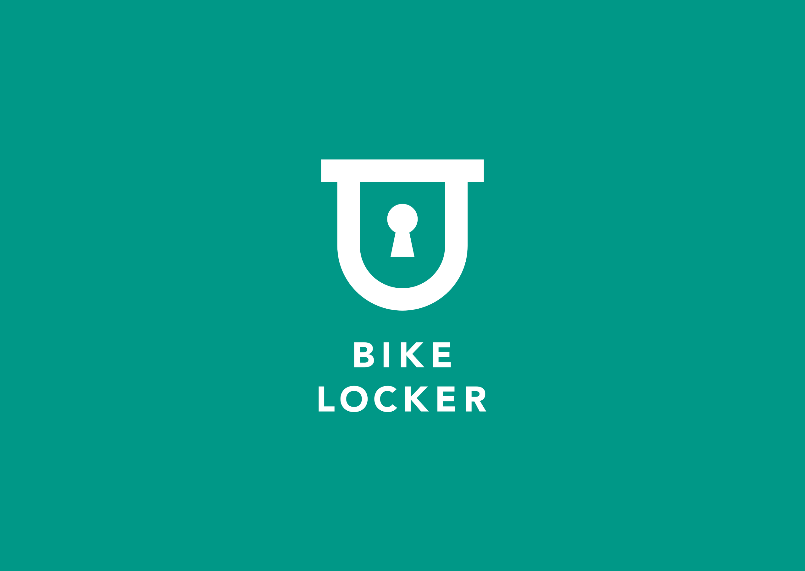
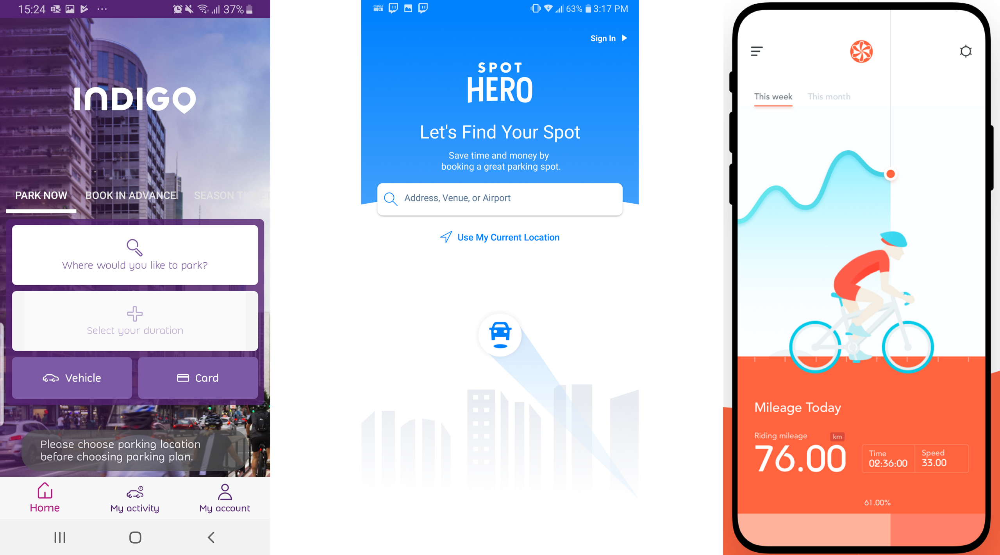
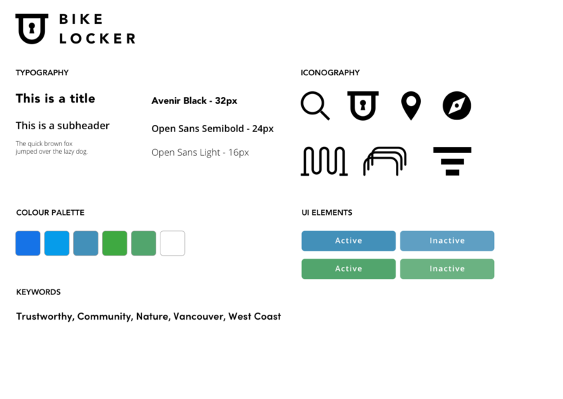
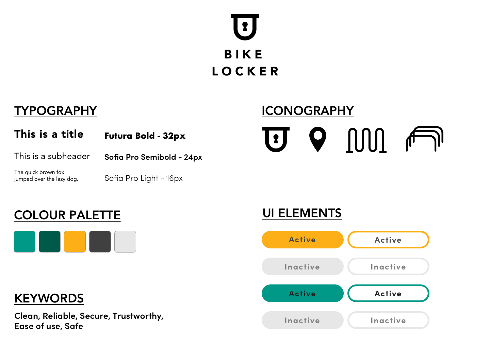
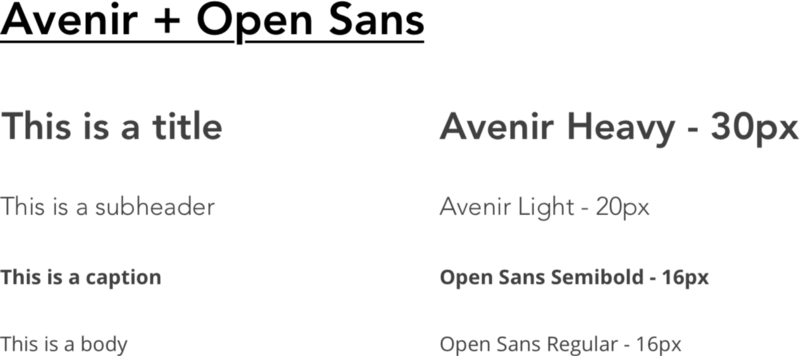
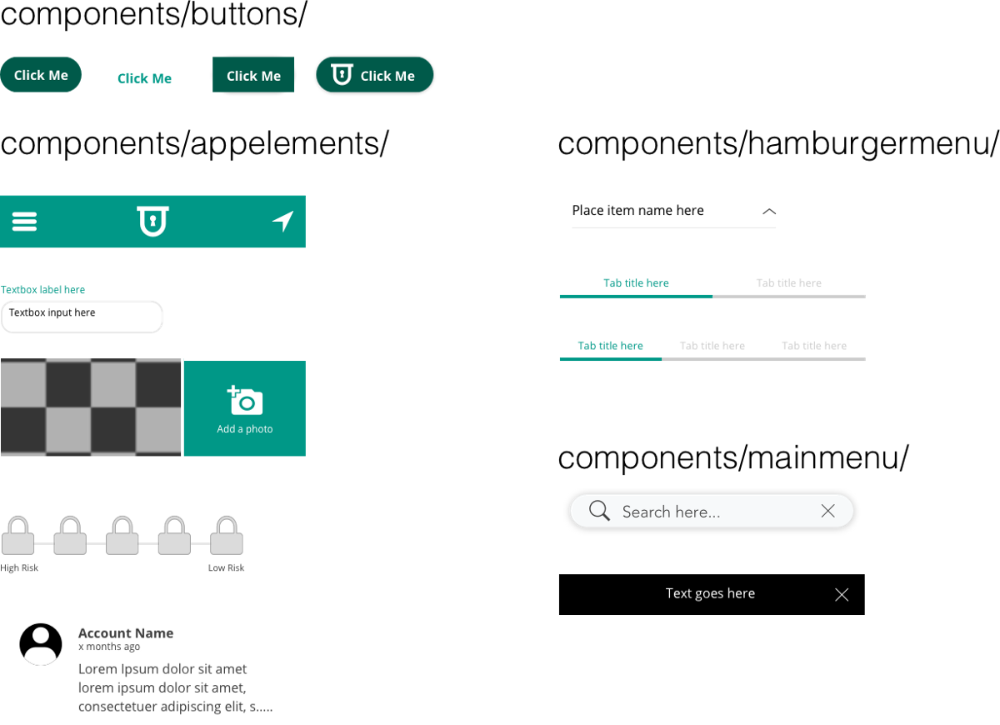
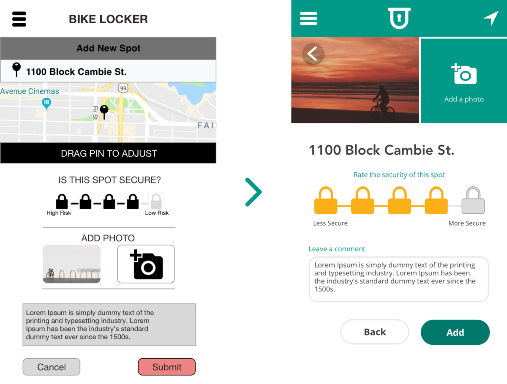

A Case Study on mobile UI design and collaboration

#### Team members

Paola Hinojosa, Oliver Janousek, Jacob Krayenhoff — UX  
Phoebe Chou, Irene Khorsand Mahand, Patrik Lau — UI

#### **Introduction**

For this project I was placed in a six person team split between UX and UI that would design a minimum viable product for a community partner in three weeks. For us in the UI team this became creating a visual design style tile, a collaborative Sketch document, and a cohesive iconographic library to use within the app. This project was done as a collaborative effort to practice an agency styled working environment and making a whole UI library for a client.

A note for this project I took on being the scrum master for the group and being the main point of contact with the client.

Project goals, business goals, user goals

#### Establish Goals

As a whole team with the client we needed to establish the project goals, user goals, and the business goals. For the team the project goal was to make an engaging app for commuter cyclists, in order to have crowdsourced spots. The user goals was to be able to find safe and secure bicycle parking in Vancouver from the connivence of their phones. The business goal was to get a minimum viable product to shop to partners and potential sponsors.

The middle of all these was to make an app for commuter cyclists where they can find safe and secure bicycle parking near their destinations in Vancouver.

#### Creative Research

For our creative research we had the task of creating prospective art directions that the client could pick from as starting point for their visual style and identity. We as a team started by looking at competitors in the same product space with some specific examples being Indigo, Spot Hero, and examples product mockups from Pinterest. We used these as inspirations for the styles we pursed in our art directions later.

Our clients were split between image heavy and illustrative styles

We did this to start building a test for our client called a Gut Test which we used to gauge their reception to different colour palettes, visual styles, and mood images. Our client’s reaction to the Gut Test told us that they were split on use of imagery versus illustrations and preferred clean, simple visual styles as seen above.

> Peace of mind, safe, secure

These were the mood keywords that we came up with from the Gut Test and used these in combination with our Gut Test results to purse two art directions, Clean and Vancouver. From this we made a design inception to inform a framework that we could visually design within for Bike Locker.

#### Why

Our client’s why and what we ended up with is to provide security and peace of mind to cyclists. This informed the space, shape, and movement of our design inception as the colours were picked by the client.

During this time UX did their domain research with our help, and moved into the planning phase of their work. Their planning phase was creating use cases, feature lists, sitemaps, and workflows.

#### UI Design Process

The Vancouver style was designed to be modern and sleek, with more nature related colours such as green and blue. We chose slightly rounded corners for square elements to convey a sense of playfulness and to feel less sharp and hostile.

The Clean style was designed to be minimal and friendly, to fit the keywords of calm and reliable. We used purple and orange to convey a feeling of trust, and chose fully rounded corners to feel friendly and the least hostile.

However after presenting to the client, they wanted to proceed with their existing branding. We made a style tile for their branding which incorporated some of the elements of our previous art directions and used their colour palette, which in combination felt trustworthy and reliable but mature at the same time.

We were given Avenir to use in the project from the client, but we also added Open Sans for body copy. We found that Avenir worked well for eye catching headliners that needed attention, but didn’t work well as body copy as it was too light in it’s Light family and too heavy in it’s Medium family. Open Sans felt both legible and modern thanks to it’s origin as a digital display typeface by Google.

We chose to draw icons that would appear as negative space in floating circles or as a part of contrasting backgrounds. They are drawn in a way to avoid extra details and have rounded corners and strokes to follow the style we’ve made.

UI Elements in a vaccum

#### Collaboration

From the style tile we made a series of UI elements that UX informed us would appear in the wireframes which we made in Sketch. We made a unified shared library document with text styles and these UI elements as symbols to be used and updated from so that we had a unified design.

From MidFi to HighFi

At this point in the project we were given mid fidelity wireframes to begin development of our high fidelity wireframes. We worked closely with UX at this time, sitting in the same area often, in order to skin their work and resolve changes quickly with the entire team. This process was very helpful for a speedy workflow as we could present an early version of a workflow to the UX team and get it sent for feedback before completing the design.

Rating Picker progress

We made the rating picker with the UX team as this feature required input and testing from the UX team but the style and look from the UI team. Our initial draft of the picker was confusing and did not appear clickable, and we identified the reasons to be the labels and the lack of a clear inactive state on the locks. We fixed this by adding an outline which is unusual for our style and is similar to iOS guidelines for an inactive button, as well as changing the picker labels.

Location Pin progress

The location pins feature is another example of working closely with the UX team to iterate and design quickly. We started this design by using the brand colours, however when given blind to testers they could not rate them in a one through five rating in the order we imagined. This led to using more colours with distinct contrasts to make a clear hierarchy between them using both colour connotations and hues to go from light to dark.

#### Prototype

You can view the prototype at this link: [https://invis.io/5SS1H1XAYR6](https://invis.io/5SS1H1XAYR6)

The prototype walkthrough was made by the UX team, where the UI team helped make screens with modifications as needed. We worked fairly closely at this point in order to make visual changes quickly as the UX team came across errors and problems.

#### Conclusion

This project highlighted what it means to be collaborative and how to direct a team through issues. While not spoken much about in this case study, being the scrum master also became being a part time project leader as I had the most information on problems and gaps in our work. With that knowledge I was able to prod and push team members when behind or stuck in order to make our three timeline.

Hard skills I learned were how to make a basic shared UI library in Sketch and organisational methods to work on Sketch files as a team without overwriting work. We made a master file and had individual files that we worked on and pushed content onto the master file once checked by each other.

From this work we as an entire team made a working prototype walkthrough for our client’s minimum viable product scope, and did research towards a phase two of their product. UX made many research steps on the domain and for the business goals to make an interesting crowdsource product that could scale into a premium product. UI made a clean and simple design that has room to be expanded with a more illustrative style if needed for phase two.

For the future I’ll take the lessons I learned in collaboration and working within a small team. We as a team know there is a badge reward system that would need to be visually designed, as well as improvements to the overall menu system to match current trends.