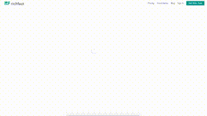

Here are some of the challenges I've completed for Daily UI. I do these to keep myself sharp by looking at new design trends and trying them out for myself.

I make these mostly with Adobe XD, sometimes with Sketch, and I want to try Figma out.

I converted these files from .mp4 to .gif using [FFmpeg](https://ffmpeg.org/).

Uploads are handled automatically by uploading to this repo.

