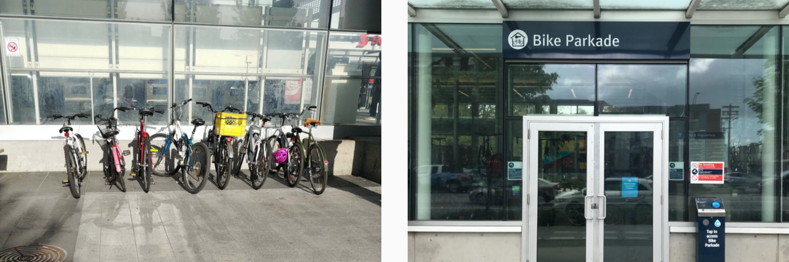
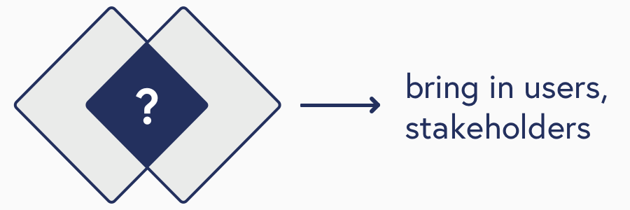
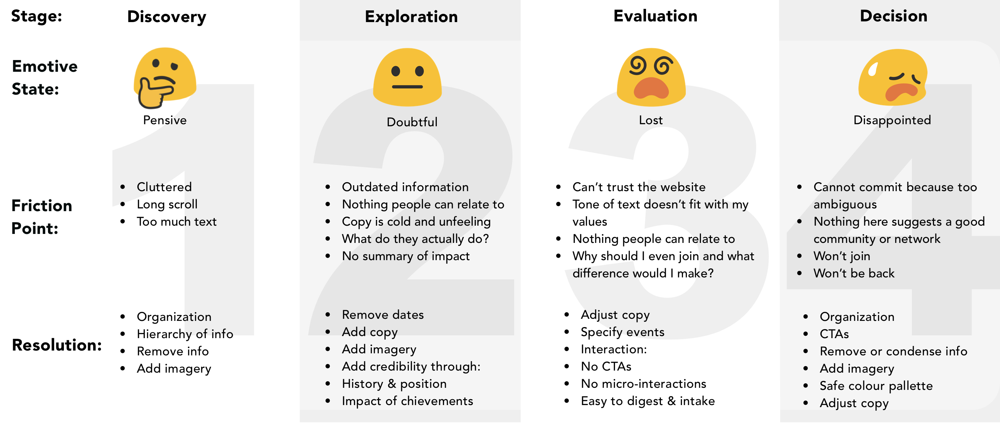
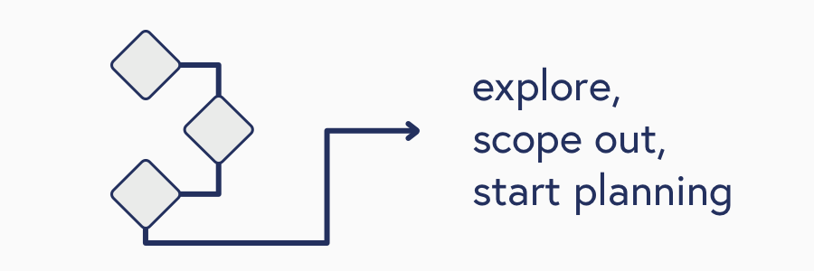
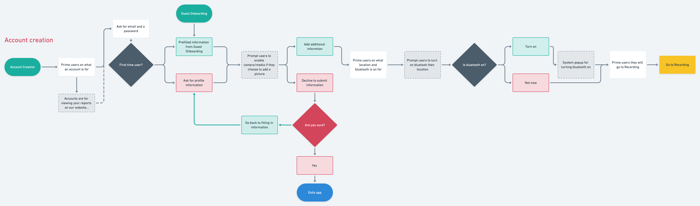
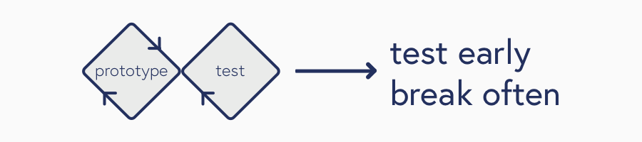
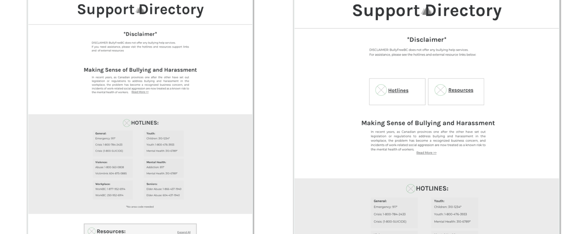

## Process - From Thinking to Doing

### Empathize

My design process starts with building an understanding of the domain, users, and stakeholders involved. Doing this creates hypotheses I can test in the next part of the process.

By building an understanding, I can discover initial insights, uncover the unknown, and challenge assumptions made during leading up to this part of the design process.

See this project at [Bike Locker](/bikelocker).

Users have an existing workflow that they use to fufill their goals. Uncovering the mechanisms of their workflow gives me a better understanding where features can be expected to fit into their workflow.

### Define

From analysing the data from research, discussing with stakeholders such as project managers and clients, I am able to start building a vision of what is the problem space and align on possible solutions with the rest of the team.

At this point it’s important to keep in mind the scope of the project and define a vision that is understood by all involved parties. Lots of discussion, lots of stickies, but ultimately I do it to meet inbetween user needs and business goals.

See this project at [BullyFreeBC](/bfbc).

I believe in utilizing tools like journey maps and user personas which let me define the problem space to myself and other stakeholders. These tools to me are like the framing of a house, without them I'd have no structure to build on.

### Ideate

Ideation involves exploring the problem space I just defined. Creating design artifacts, like feature lists and user flows, let me explore the touchpoints where my design will interact with users.

I believe in making design artifacts to present the initial vision of the project to other designers, project managers, and developers.

An important lesson from [Jane Wong](https://medium.com/ssense-tech/designing-with-ambiguity-part-ii-design-doing-not-thinking-4065c07e7373) is to connect the dots but not all of them.

>"There were times we went down rabbit holes and lost sight of the bigger picture in a frenzy of ideas. This could unnecessarily draw out any ideation phase, when sometimes the best action is to sum up your findings and carry on in a direction."

### Prototype - Testing

> Test early, break often

Prototyping to me is validating ideas and to start "think by doing". From making paper prototypes, light weight Sketch+Invision mockups, or even fully featured Adobe XD prototypes, these are to start checking our thoughts if they are true.

From here I can refine, build, test, and repeat until I reach a stable conclusion that fits both business goals and user goals.

More time spent to playing, testing, and iterating on concepts lets the team move forward with more decisiveness and clarity.
