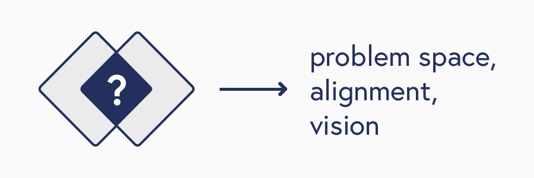

## Process - From Thinking to Doing

My design process starts with building an understanding of the domain, users, and stakeholders involved.

This is to discover the team's initial insights, uncover the unknown, and challenge assumptions made during leading up to this part of the design process.

See this project at [Bike Locker](/bikelocker).

Users have an existing workflow that they use to fufill their goals. Uncovering the mechanisms of thier workflow gives us a better understanding where features can be expeceted to fit into their workflow.

