<!-- Event Branding — A Case Study on concepting and branding a theoretical event. -->

<!-- 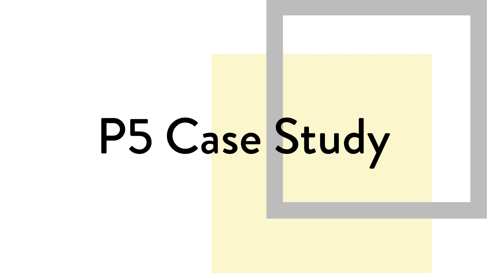 -->
<!-- A Case Study on concepting and branding a theoretical event. -->

#### Introduction

Our final project for the UI course at RED Academy was to concept and brand an event with digital and physical brand assets. The overall project goal was to concept an event, create a central why that would dictate the event’s purpose, and create brand assets that represent the brand’s values.

Tools used: Pen and Paper, Adobe Illustrator, Adobe Photoshop, Sketch, and Principle for animations.

Breaking it down into deliverables:  

* _Concept an event and brand that is behind the event._  
* Design a visual style for the brand.  
* Wireframe and produce high fidelity mockups for a responsive website.  
* _Create digital and physical brand assets._

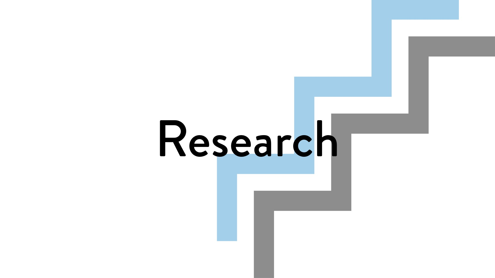

#### Conception of SPEAK

At the beginning of this project I wanted to try designing a **design system** for a series of something, anything really. I wanted to design a logo system for an event that happens yearly and can be modified to fit each year. What I ended with was not a design system but an **expandable branding style**.

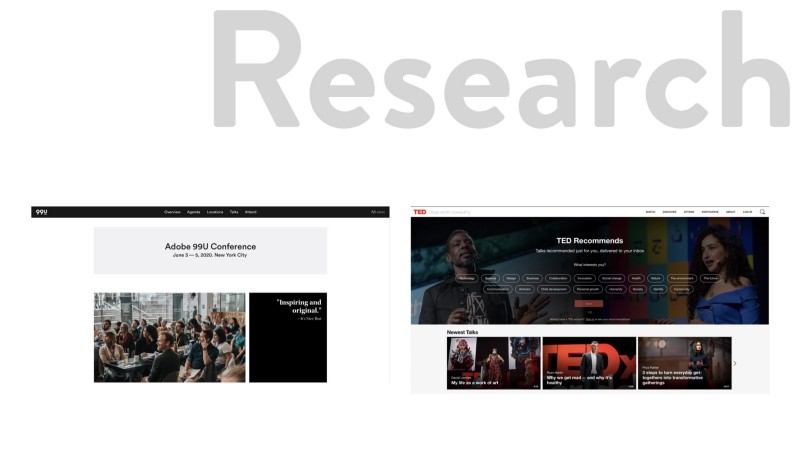

I thought of a topic for an event, I thought of how hard it was to decide on what to eat after a day of class. **Decision fatigue**, which was too specific as a topic, lead me to start looking into talk conferences similar to TED Talks or South by Southwest and design conferences like Awwward’s yearly conference and Design Thinkers. I took inspiration from these for the **format** of the conference and the **branding** of the conference respectively.

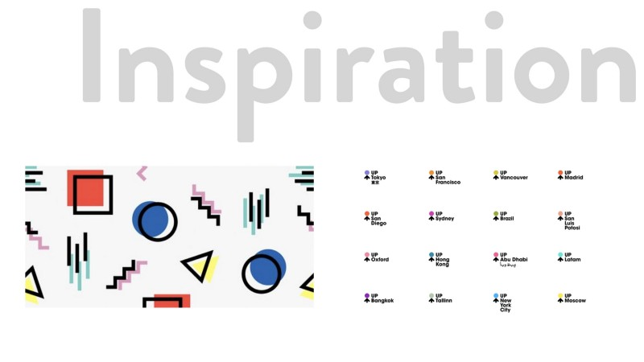

For design inspirations I looked at various brand systems and grid based logos as exploration into making my own design system. I found some examples from Pinterest for grid based logos, Up Global and SXSW for design systems, and various Memphis design examples for general inspiration.

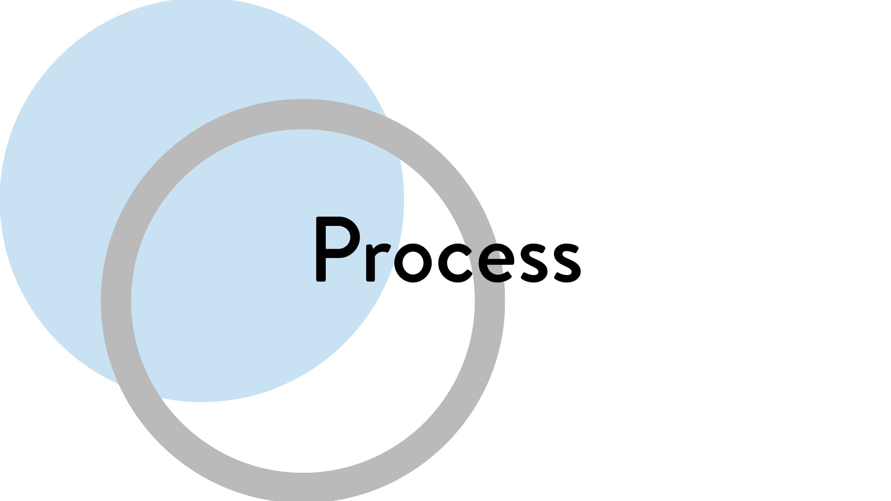

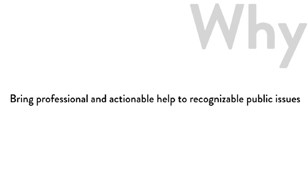
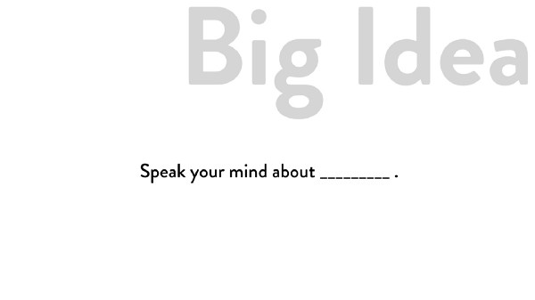

#### Why and Big Idea

My next steps were to think of a central Why as well as a Big Idea to solidify the brand identity and visual style.

SPEAK’s Why, (insert why here). The conferences purpose is to let the public in Vancouver hear from the best in their field talk and educate about their expertise particularly on public issues.

The Big Idea or slogan is Speak your mind about \_\_\_\_\_\_\_\_\_\_\_\_\_. The big blank spot is to represent the changing topic as well as a fill in the blank that the public gets to vote on. This Big Idea informed the name of the conference, as well as the visual style of the brand once the name was decided.

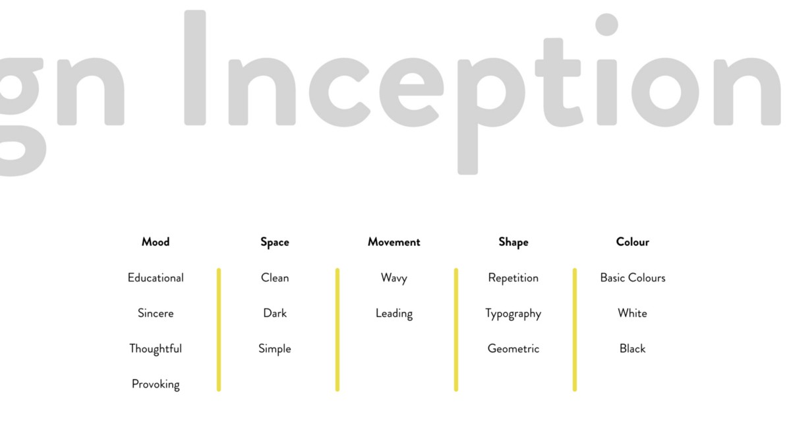

The mood of SPEAK should be **educational**, **thoughtful** and **provoking** to entice people into action. The shapes and colours should be **basic** and similar to what is taught as **foundational** **knowledge**. This will be expanded on in the style tile.

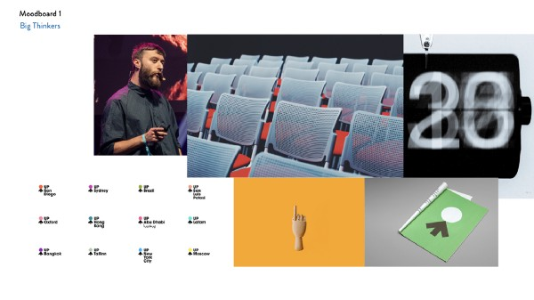
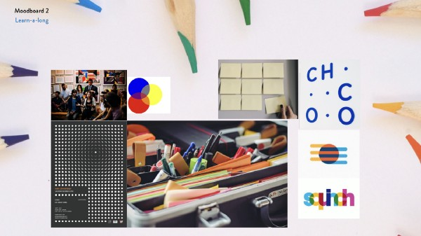

From deciding on the Why and the event name, I came up with the general topic for this year’s conference which was mental health. I blew the small topic of **decision fatigue** up to the overall topic of mental health. In **retrospect** I would have liked to make the topic less heavy sounding and instead chose mental wellness, or taking care of your brain.

At this point I made two moodboards to decide which direction to take this conference. The big conference mood is meant to be educational, provoking, and impersonal. The Learn-along mood is meant to be thoughtful, sincere, and active.

I chose to go forward with something inbetween these two, using the keywords of **educational**, **provoking**, and **sincere** to drive the mood.

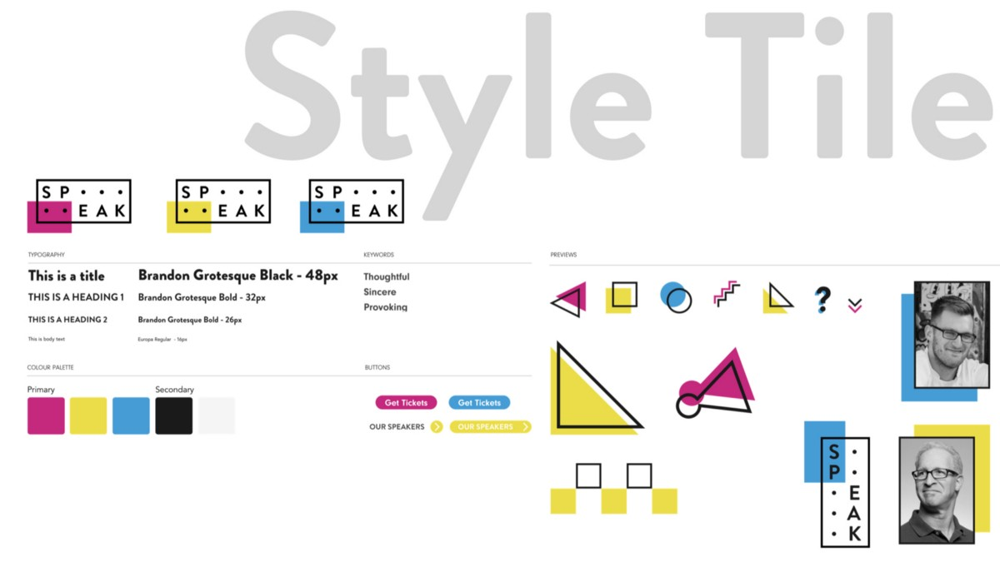

From my prior research of Memphis Design, I noticed the repetition of basic geometric shapes and of bright foundational colours like cyan, magenta, and teal. Basic shapes and colours being concepts and knowledge that are **taught** in early education, and being foundational knowledge to both mathematics and colour theory respectively I decided to connect the slogan of SPEAK to the theme of teaching **foundational knowledge**.

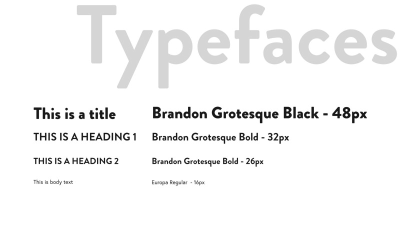

This event is for the public and is meant to be inviting, so I chose Brandon Grotesque for it’s humanist sans serif background and clean characters to be used for both the logo and for display text on the website.

For body text I chose Europa as it is a clean sans serif known for legibility, which is the secondary focus of the website as it is has a schedule that is meant to be fetched daily.

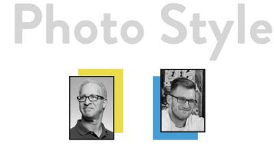
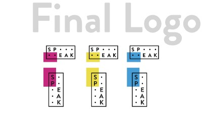
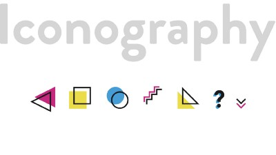

To go with the theme of foundational knowledge, I chose to base my colour palette and graphic elements on the CYMK colour wheel and basic geometric shapes. The CYMK colour wheel is the foundation for subtractive colour theory, and is the colours that printers use to print all colours. Geometric shapes were chosen to **remind** viewers of the shapes and they’ve been taught in elementary education and are an essential part of mathematics.

I took inspiration from Memphis Design graphic design, and it shows in the repetition of shapes as outlines at 45 degrees from the original shape. Additionally I greyscaled all images shown on the website to **remove** visual focus from the images while still **attaching** the brand to real people and places.

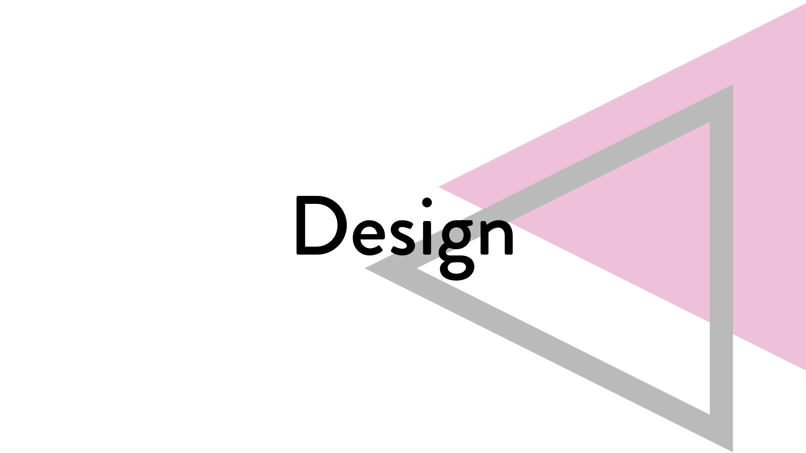

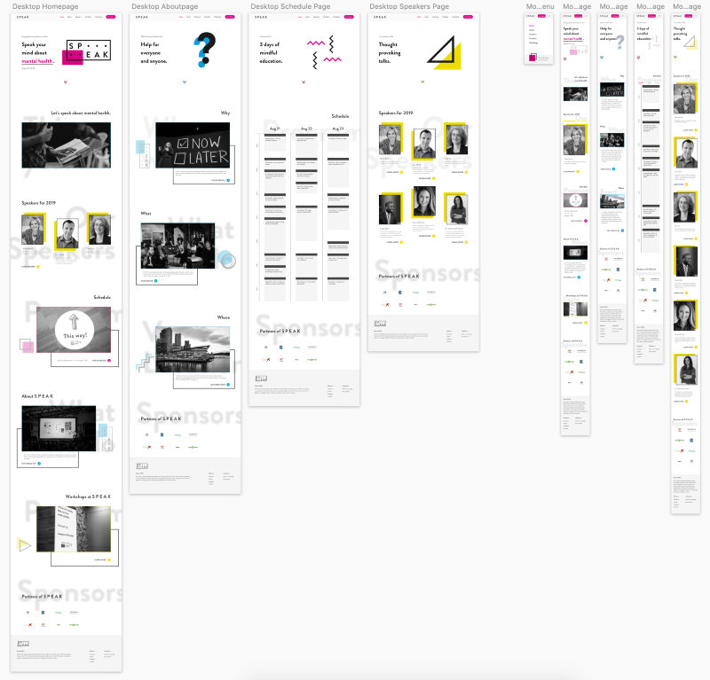
All wireframes in Sketch

#### Wireframes

For this part of the project we as individual UI designers had to do a little bit of UX work. We had to make a quick story for potential users to decide on 4 screens of our website to create. For SPEAK I had two quick **tasks** for users, which were to see the schedule of SPEAK online and to learn more about the SPEAK conference as well as speakers. This resulted in having a landing page, a schedule page, a speakers page, and an about SPEAK page.

I made a short video walkthrough of desktop and mobile using Principle.

Full Walkthrough of the homepage

#### Hero Banner design

The hero banners were designed with the main slogan in mind, being built as a three line block to **maximize** it’s visual space vertically and be balanced with a graphical element as a part of the hero banner of each page. These banners **scale** to a mobile size by turning the graphical element transparent and splitting the space into an upper left and lower right section, with the banner text taking **priority** and being fully opaque.

Screen Transitions

#### Animated Banners and Fade Transitions

I chose to animate banners and add fade transitions to the website to add an attention grabbing elements and visual surprises. The animated banners passively move around to gather **attention** to the message of the page. A **missed opportunity** would be to animate the leading arrows to remind viewers to scroll along the page away from the hero banner.

The fade transitions between pages when clicking links was chosen to have an intentionally **low visual impact**. By fading out content at a moderate pace and fading in content at a moderate pace, I can potentially keep the attention of a user without “**jerking**” their eyes around a screen.

#### Parallax subtitles for sections

I chose to cut up pages into sections, and for each of these sections to have an image, a title, and a subtitle at minimum. The subtitle for each of these section was to be in a parallax scrolling effect to make a for **pleasant surprise** and to cover the large amount of **whitespace** between sections. This is done to elongate the viewing experience, and to let a viewer **learn** something immediately by letting them have control over viewing information.

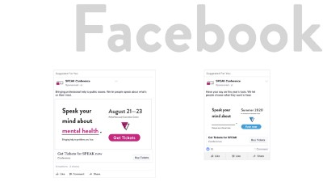
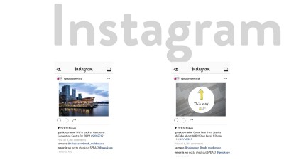
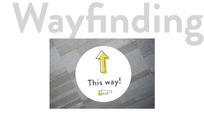

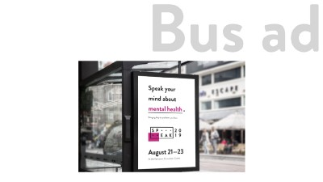

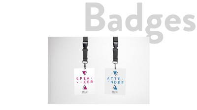

#### Physical Brand Assets

I made a few physical asset mockups for SPEAK, which included a bus ad, wayfinding and signage to be used within the Vancouver Convention Centre, and a set of badges for guests of SPEAK. There are also digital ads meant for Facebook and Instagram, and as a sidenote, are not technically ready for display as pointed out by a classmate as the Facebook ad has too much text which break’s Facebook’s ad rules.

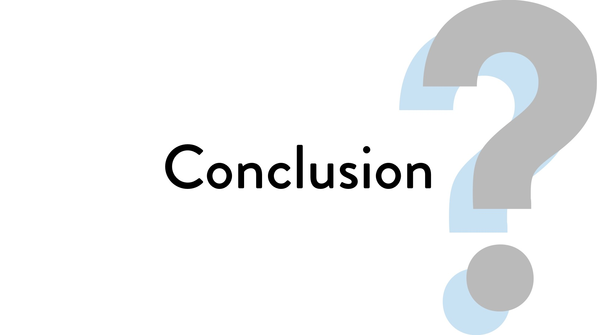

#### Conclusion

This project was a learning lesson motivating myself and working on vague project ideas.

For this project I was left mostly up to myself in terms of design decisions, and had to judge myself as a client as well as a designer. That back and forth while fun is hard to work within, and a learning lesson from a classmate is to write down what I thought of as a client so I can go back and read that as a designer to make the decision more impartial.

In terms of visual design this project I enjoyed making the assets and animating the project as it was simple and clean. I prefer to make designs that are systemic and self explanatory, which I don’t think this design completely did but is a start.

An interesting question that was brought up during my presentation of this project was if the visual style was attached to SPEAK or to the yearly theme of mental health, at the time that was not decided but at this point the visual style is part of SPEAK. I chose this because of how this visual style plays toward the educational mood of SPEAK as a conference rather than the inner workings of mental health.

For the future I want to remember the lesson of plan deliberately and design deliberately. During this project I left things to air and let my design choose where it wanted to go. If something fit I let it be, instead of justifying it and holding up to question. The result looks okay, but has few design decisions behind the overall design which makes it fall apart under scrutiny.

A specific example is the visual style of SPEAK versus the yearly theme, as that is an area not explored well. My original intent was to make a design system, which this project didn’t quite meet. Being able to make a visual language for SPEAK as a conference to combine with a visual style for the yearly theme would have made a design system.

However this project came to a close and I’m happy with how it turned out, and glad there are many learning lessons from it.