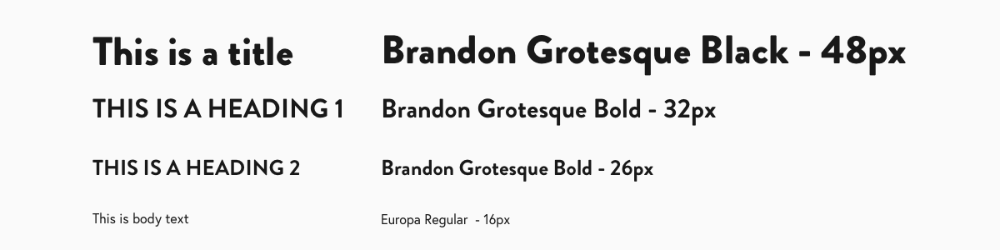
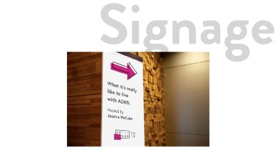

<section>

#### Introduction

Our final project for the UI course at RED Academy was to concept and brand an event with digital and physical brand assets. The overall project goal was to concept an event, create a central why that would dictate the event’s purpose, and create brand assets that represent the brand’s values.

Tools used: Pen and Paper, Adobe Illustrator, Adobe Photoshop, Sketch, and Principle for animations.

Breaking it down into deliverables:

* _Concept an event and brand that is behind the event._
* Design a visual style for the brand.
* Wireframe and produce high fidelity mockups for a responsive website.
* _Create digital and physical brand assets._

<!--  -->

</section>

<section>

#### Conception of SPEAK

At the beginning of this project I wanted to try designing a design system for a series of something, anything really.

I wanted to design a logo system for an event that happens yearly and can be modified to fit each year. What I ended with was not a design system but an expandable branding style.


I looked into conferences such as TED or South by Southwest and design conferences like Awwward’s conference and Design Thinkers. I took inspiration from these for the format of the conference and the branding of the conference respectively.


For design inspirations I looked at various brand systems and grid based logos as exploration into making my own design system.

I found some examples from Pinterest for grid based logos, Up Global and SXSW for design systems, and various Memphis design examples for general inspiration.

<!--  -->

</section>

<section>

#### Why and Big Idea

> Bring professional and actionalble help to recognizable public issues and Speak your mind about _________.

The conference's why is to let the public in Vancouver hear from the best in their field talk and educate about their expertise particularly on public issues.

The Big Idea or slogan is Speak your mind about \_\_\_\_\_\_\_\_\_\_\_\_\_. The big blank line is to represent the changing topic as well as a fill in the blank that the public gets to vote on. This Big Idea informed the name of the conference, as well as the visual style of the brand once the name was decided.


The mood of SPEAK should be:

* educational
* thoughtful
* provoking

This is meant to entice people into action. The shapes and colours should be basic geometric shapes and similar to what is taught as foundational knowledge. This will be expanded on in the style tile.

```grid|2


```

I came up with the general topic for this year’s conference which was mental health. In retrospect I would have liked to make the topic less heavy sounding and instead chose mental wellness, or taking care of your brain.

I made two moodboards to decide which direction to take this conference.

The big conference mood is meant to be:

* educational
* provoking
* impersonal

The Learn-along mood is meant to be:

* thoughtful
* sincere
* active

I chose to go forward with something inbetween these two moods using the keywords of educational, provoking, and sincere.

</section>

<section>

#### Styling for SPEAK


From research of Memphis Design, I liked the repetition of basic geometric shapes and of bright foundational colours such as cyan, magenta, and teal.

Basic shapes and colours being concepts that are taught in early education, and being foundational knowledge to both mathematics and colour theory respectively I decided to connect the slogan of SPEAK to the theme of teaching foundational knowledge.



This event is for the public and is meant to be inviting, so I chose Brandon Grotesque for it’s humanist sans serif background and clean characters to be used for both the logo and for display text on the website.

For body text I chose Europa as it is a clean sans serif known for legibility, which is the secondary focus of the website as it is public facing and needs to be accessible by everyone.


To go with the theme of foundational knowledge I chose to base my colour palette and graphic elements on the CYMK colour wheel and basic geometric shapes.

The CYMK colour wheel is the foundation for subtractive colour theory, and is the colours that printers use to print all colours.

Base geometric shapes were chosen to remind viewers of the shapes they’ve been taught in elementary education.

I took inspiration from Memphis Design graphic design, and it shows in the repetition of shapes as outlines at 45 degrees from the original shape.

I greyscaled all images shown on the website to remove visual focus from the images while still attaching the brand to real people and places.

</section>

<section>

<!--  -->


#### Wireframes

I had to make a quick story for potential users to decide on 4 screens of the website to create.

For SPEAK I had two quick tasks for users, which were to see the schedule of SPEAK online and to learn more about the SPEAK conference as well as speakers.

This resulted in having:

* a landing page
* a schedule page
* a speakers page
* and an about SPEAK page

I made a short video walkthrough of desktop and mobile using Principle.

<div><p><iframe src="https://player.vimeo.com/video/358225212" height="454" frameborder="0" allow="autoplay; fullscreen" allowfullscreen></iframe></p></div>

<figcaption>Walkthrough of the homepage</figcaption>

#### Hero Banners

The hero banners were designed with the main slogan in mind, being built as a three line block to maximize it’s visual space vertically and be balanced with a graphical element to the right.

These banners scale to a mobile size by turning the graphical element transparent and splitting the space into an upper left and lower right section, with the banner text taking priority and being fully opaque.

<div><p><iframe src="https://player.vimeo.com/video/358225201" height="454" frameborder="0" allow="autoplay; fullscreen" allowfullscreen></iframe></p></div>

<figcaption>Screen Transitions</figcaption>

#### Animated Banners and Fade Transitions

I chose to animate banners and add fade transitions to the website to make room for attention grabbing elements and visual surprises.

The animated banners continously move to gather attention to the message of the banner.

Fade transitions between pages when clicking links were chosen to have an intentionally low visual impact.

By fading out and fading in content at a moderate pace, I can keep the attention of a user without “jerking” their eyes around the screen.

#### Parallax subtitles for sections

I chose to cut up pages into sections. Each of these sections have:

* an image
* a title
* and a subtitle

The subtitle for each of these section was to scroll into view ahead of the section with a parralax effect to make a for pleasant surprise and to cover the large amount of whitespace between sections.

This is done to elongate the viewing experience, and to let a viewer always have content presented to them no matter where on the page.

```grid|3


```

```grid|3



```

#### Brand Assets

I made a few physical asset mockups for SPEAK which include:

* a ad for placement at bus stops
* signage and wayfinding to be used within the Vancouver Convention Centre
* a series of badges for attendees of SPEAK

There are also digital ads meant for Facebook and Instagram, but are not ready for use as pointed out by a classmate as the Facebook ad break’s Facebook’s rules for ads.

<!--  -->

</section>

<section>

#### Final thoughts

The back and forth while fun is difficult. A learning lesson is to write down thoughts from the prespective of a client so I use that as the designer to make a decision more impartial.

An interesting question was if the visual style made was for SPEAK or for the yearly theme of mental health.

I believe the current theme would fit the conferece theme and not the yearly topic because of how this visual style plays toward the educational mood of SPEAK as a conference rather than the inner workings of mental health.

#### Conclusion

For the future I want to remember the lesson of planning deliberately and designing deliberately.

During this project I left things up in the air and let my design choose where it wanted to go.

If something fit I let it be, instead of justifying it and holding up to question. The result looks fine, but has few concrete design decisions behind the overall design which cause it fall apart under scrutiny.

However this project came to a close and I’m happy with how it turned out, and glad there are many learning lessons from it.

</section>