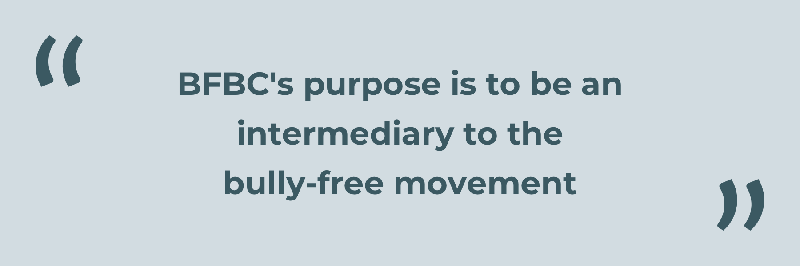

>
>When you see the words “bully-free website”, what do you think of and what do you expect to take away from such a place?  
>  

For this project I researched, designed, prototyped, tested, and iterated on a website for BullyFreeBC(**BFBC**) that focused on **acquisition** and **retention** of new members for BFBC's relaunch.

In **three weeks** we mocked up **50+** high fidelity wireframes for both desktop and mobile. I was on the UX side of this project doing research, planning, information architecture, wireframing, user testing, and prototyping.

This project ended up being about designing **against the common expectations of users** and meeting the business goals within those constraints.

